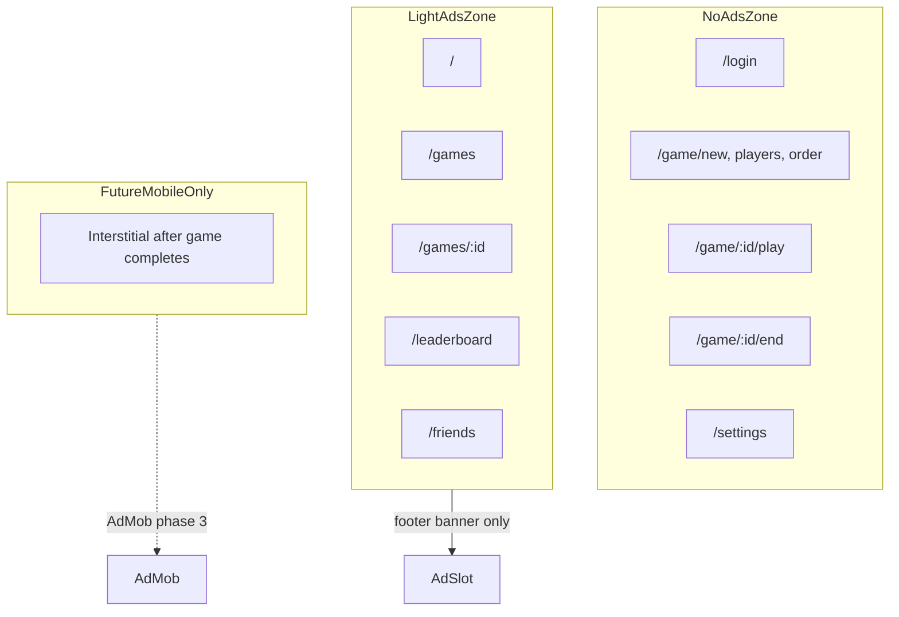

# Clean ad monetization (web now, mobile-ready)

## Recommendation summary

| Layer | Tool | Why |
|-------|------|-----|
| Web ads | **Google AdSense** | Easiest start, auto-optimizes formats, pairs with your domain |
| Mobile ads (later) | **Google AdMob** | Same Google account; native banners/interstitials in iOS/Android |
| Analytics | **GA4** (optional, separate) | Measure traffic; does not pay you |
| Future premium | **Subscription / IAP** | Gate ads via `adsEnabled` flag when you add paid features |

**Do not** use AdSense inside a future mobile WebView — store apps require **AdMob** native SDKs.

At ~100 users/day, expect modest revenue. Maximize it later with **public content pages** (landing, guides) rather than cramming ads into gameplay.

---

## Placement philosophy

Treat the app in three zones:



**Web (phase 1):** one **footer banner** (320×50 mobile / 728×90 desktop) on LightAdsZone pages only.

**Avoid on web:** interstitials, in-feed ads between game list items, sidebar overlays — they earn little here and hurt the scorekeeping UX.

**Mobile (phase 3):** same no-ad routes; add a **single interstitial** only at a natural break (e.g. after viewing completed game summary, before returning home) — never during active play.

---

## Why a public landing page matters

Today almost every route is behind [`ProtectedRoute`](frontend/src/auth/ProtectedRoute.tsx). AdSense approval and SEO both favor **crawlable public pages**.

**Recommended (phase 1b, small addition):**
- Add `/` as a **public marketing landing** (features, screenshots, login CTA)
- Move the current dashboard to `/dashboard` (protected)
- Keeps ads off login while giving Google indexable content at `scrabblehelper.com`

This is optional for code structure but **highly recommended** before applying for AdSense.

---

## Architecture (future-proof)

Introduce a small ads module in the frontend — no backend changes required initially.

### 1. Ad policy config — [`frontend/src/ads/adPolicy.ts`](frontend/src/ads/adPolicy.ts) (new)

Central allowlist keyed by route pattern:

```ts
// Pseudocode
const NO_AD_PREFIXES = ["/login", "/settings", "/game/"];
const NO_AD_EXACT = []; // or fine-grained: allow /games, block /game/:id/play

export function adPlacementForPath(pathname: string): "footer-banner" | null;
export function adsEnabledForUser(user: User | null): boolean; // true today; later: !user?.is_premium
```

Use `matchPath` from `react-router-dom` to distinguish `/games` from `/game/:id/play`.

### 2. Reusable slot component — [`frontend/src/ads/AdSlot.tsx`](frontend/src/ads/AdSlot.tsx) (new)

- Reads `VITE_ADSENSE_CLIENT_ID` and `VITE_ADS_ENABLED` (false in dev/CI)
- Renders a labeled container: **"Advertisement"** + reserved min-height (`min-height: 90px`) to prevent CLS
- Loads AdSense script once via [`frontend/src/ads/loadAdSense.ts`](frontend/src/ads/loadAdSense.ts)
- Returns `null` when disabled, no client ID, or route is in NoAdsZone
- Styled to match existing cards in [`frontend/src/styles.css`](frontend/src/styles.css) (`--border`, `--muted`, subtle background)

### 3. Shell integration — [`frontend/src/App.tsx`](frontend/src/App.tsx)

Add `<AdSlot placement="footer-banner" />` inside `AppShell`, **below** `<main>`, driven by `useLocation()` + ad policy. Gameplay pages never mount the slot.

This is cleaner than sprinkling `<AdSlot />` on six pages individually.

### 4. Premium hook (stub now)

In [`frontend/src/ads/adPolicy.ts`](frontend/src/ads/adPolicy.ts):

```ts
export function adsEnabledForUser(_user: User | null): boolean {
  return true; // TODO: return !user?.is_premium when subscription ships
}
```

Wire through `useAuth()` in `AdSlot` so premium is a one-line change later.

---

## Legal and compliance (required before enabling ads)

| Item | Action |
|------|--------|
| Privacy policy | New page `/privacy` + footer link; disclose AdSense, cookies, GA4 |
| Cookie consent (EEA/UK) | Google **Consent Mode v2** banner (e.g. lightweight CMP or `react-cookie-consent` + gtag consent defaults) |
| `ads.txt` | Static file at [`frontend/public/ads.txt`](frontend/public/ads.txt) — AdSense provides the line after approval |
| FTC/Google labeling | Visible "Advertisement" above each slot |

No privacy policy exists today — add before production ads.

---

## AdSense setup (manual, outside code)

1. Apply at [Google AdSense](https://www.google.com/adsense/) with `scrabblehelper.com`
2. After approval, create ad units (start with **display / responsive** or fixed banner)
3. Set Fly/Vite env: `VITE_ADSENSE_CLIENT_ID=ca-pub-XXXX`, `VITE_ADS_ENABLED=true`
4. Deploy; verify with AdSense site checker

Keep `VITE_ADS_ENABLED=false` in local dev and CI ([`.github/workflows/ci.yml`](.github/workflows/ci.yml) needs no ad scripts).

---

## Mobile path (when you build iOS/Android)

Share the **same route policy** concept; swap the renderer:

| Web | Mobile |
|-----|--------|
| `AdSlot` → AdSense `<ins>` | `AdBanner` → AdMob `BannerAd` |
| No interstitials initially | Optional `InterstitialAd` at game-complete break only |
| `VITE_*` env vars | AdMob app IDs per platform (Info.plist / AndroidManifest) |

If you use **React Native**: `react-native-google-mobile-ads`.  
If you use **Capacitor** wrapping the web app: native AdMob plugin — **do not** rely on AdSense in the WebView.

Future subscription on mobile: Apple/Google IAP removes ads via the same `adsEnabledForUser()` check synced from your backend.

---

## Revenue expectations (realistic)

With footer banners on ~5 browsing pages and **no ads during play**:

- ~100 DAU → roughly **$5–30/month** depending on geography and pageviews
- Biggest lever later: **public SEO content** (word lists, opening strategy) with in-article ads — not more slots in the app shell

---

## Implementation phases

### Phase 1 — Ad infrastructure (web)
- Add `ads/` module (`adPolicy.ts`, `AdSlot.tsx`, `loadAdSense.ts`)
- Integrate footer slot in `AppShell`
- Env vars + styling for reserved-height slot
- Stub `adsEnabledForUser` for future premium

### Phase 1b — Public presence (recommended before AdSense apply)
- Public landing at `/`, dashboard at `/dashboard`
- `/privacy` page + footer links in [`SiteHeader`](frontend/src/components/SiteHeader.tsx) or a slim site footer
- `ads.txt` placeholder in `frontend/public/`

### Phase 2 — Consent + go live
- Cookie consent banner with Consent Mode v2
- Set Fly secrets / build args for AdSense client ID
- Apply for AdSense; enable after approval

### Phase 3 — Mobile (later)
- Port `adPolicy` to mobile router
- Integrate AdMob; optional interstitial at game-complete only
- Respect future `is_premium` from API

---

## Files to touch

| File | Change |
|------|--------|
| [`frontend/src/App.tsx`](frontend/src/App.tsx) | Mount `AdSlot` in `AppShell`; optional route split for landing |
| [`frontend/src/ads/*`](frontend/src/ads/) | New ad policy + components |
| [`frontend/src/styles.css`](frontend/src/styles.css) | `.ad-slot` reserved height, label styling |
| [`frontend/public/ads.txt`](frontend/public/ads.txt) | AdSense verification line |
| [`frontend/src/pages/PrivacyPage.tsx`](frontend/src/pages/PrivacyPage.tsx) | New |
| [`README.md`](README.md) | Document env vars and AdSense setup |

No backend changes for phase 1–2. When premium ships, add `is_premium` to [`UserOut`](backend/app/schemas.py) / [`User`](backend/app/models.py) and read it in `adsEnabledForUser`.

---

## What we are explicitly not doing (keeps UX clean)

- No ads on [`GamePlayPage`](frontend/src/pages/GamePlayPage.tsx) or game setup flow
- No interstitials on web
- No auto-playing video ads
- No ad slots that push tap targets on mobile play UI
- No AdSense in a future mobile WebView
