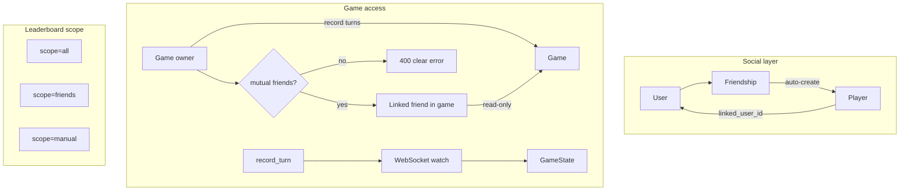

# Friends, Live Spectating, and Leaderboard Filters

## Context

Today `[Player](backend/app/models.py)` is a per-user name string with no link to accounts. `[Game](backend/app/models.py)` is owned by one user; `[get_owned_game](backend/app/services.py)` blocks everyone else. Leaderboard stats in `[stats.py](backend/app/stats.py)` aggregate only **your** completed games by **your** roster names. There is no real-time layer.

Your choices (locked in):

- **Friend list:** one-way add (A can add B without B adding A)
- **Live games:** **mutual friendship required** — both users must have added each other before a linked friend can join/spectate a live game; otherwise a clear error is returned
- **Leaderboard "All users":** entire **my roster** (friends + manual) — current scope
- **Search:** new unique `@username` field

## Architecture




## 1. Data model and migration

**New table `friendships`**

- `user_id` (who added), `friend_user_id`, `created_at`
- `UNIQUE(user_id, friend_user_id)`; index on `friend_user_id` for suggestions

**Extend `users`**

- `username` — `String(32)`, unique, indexed, nullable during migration

**Extend `players`**

- `linked_user_id` — nullable `FK(users.id)`; unique per owner: `UNIQUE(owner_user_id, linked_user_id)`

**Alembic:** `[backend/alembic/versions/003_friends_username.py](backend/alembic/versions/003_friends_username.py)`

- Backfill `username` from email local-part; append numeric suffix on collision
- Existing friend-less data unchanged

## 2. Backend — friends and users API

**New module** `[backend/app/friends.py](backend/app/friends.py)`


| Endpoint                        | Behavior                                                                                                                                                         |
| ------------------------------- | ---------------------------------------------------------------------------------------------------------------------------------------------------------------- |
| `GET /api/friends`              | List users you follow (id, username, name)                                                                                                                       |
| `POST /api/friends`             | Body `{user_id}` or `{username}` — one-way add                                                                                                                   |
| `DELETE /api/friends/{user_id}` | Unfriend (does not delete manual player row; clears `linked_user_id` or removes auto-created friend player — see below)                                          |
| `GET /api/friends/suggestions`  | Users who friended you + friends-of-friends (exclude already-following + self)                                                                                   |
| `GET /api/users/search?q=`      | Search by username prefix or email exact/prefix; return id, username, name (never full email in list unless exact self-match policy — show username + name only) |


**On `POST /api/friends`:** call `ensure_friend_player(db, user_id, friend_user_id)`:

- If no `Player` with `linked_user_id=friend`, create one using friend's `name` (update name if friend renames later via lazy sync on list)

**Mutual friendship helper** in `friends.py`:

```python
def are_mutual_friends(db, user_a_id, user_b_id) -> bool:
    # both directions exist in friendships table
```

`**GET /api/friends**` includes `mutual: bool` per entry (whether they also friended you).

`**GET /api/friends/suggestions**` prioritizes users who friended you but you haven't added back (prompt to complete mutual friendship for live play).

**Username management**

- `PATCH /api/me` or extend settings: set/change `username` with validation (3–32 chars, `[a-z0-9_]+`, unique)
- Registration flow: optional username on signup; prompt on first login if null

**Schemas:** extend `[backend/app/schemas.py](backend/app/schemas.py)` with `FriendOut`, `UserSearchOut`, `UsernameUpdate`, `LeaderboardScope`

## 3. Backend — game access, mutual check, and live watch

**Mutual friendship gate** — validate in `set_game_players` and again in `begin_game` (defense in depth):

For each selected `Player` with `linked_user_id` set, require `are_mutual_friends(db, owner_user_id, linked_user_id)`. If not mutual, return **400** with a user-facing message, e.g.:

> **"{friend_name} must add you as a friend before you can play a live game together."**

Use the friend's display `name` (or `@username`) in the message. If multiple friends fail, list each or return the first failure.

Manual players (`linked_user_id IS NULL`) are unaffected — no mutual check.

**Single active live game per linked user** — validate in `set_game_players` and `begin_game`:

A linked user may only be in **one** game with `status IN (active, ending)` at a time (across all hosts). Query: any other `GamePlayer` whose `player.linked_user_id == X` joins a game with `status` active/ending and `game_id != current`.

If violated, return **400**:

> **"User @{username} is already playing a live game."**

Use `@username` when set, else display name. Game 2's creator sees this when attaching or beginning with a friend already in Carol's live game.

Helper: `user_in_active_live_game(db, user_id) -> Game | None`

**Replace read-path guard** in `[backend/app/services.py](backend/app/services.py)`:

```python
def get_game_access(db, user_id, game_id) -> tuple[Game, Literal["owner", "spectator"]]:
```

Access granted if:

- `game.owner_user_id == user_id` → **owner** (can record turns, end game)
- Else any `GamePlayer.player.linked_user_id == user_id` **and** `are_mutual_friends(db, user_id, game.owner_user_id)` → **spectator**

(Spectator must be a linked participant **and** have mutual friendship with the host.)

Mutations (`record_turn`, `end_game`, `finalize`, etc.) still require **owner**.

Update `game_state` / `game_detail` to use `get_game_access` instead of `get_owned_game`.

**WebSocket** `[backend/app/main.py](backend/app/main.py)` + `[backend/app/realtime.py](backend/app/realtime.py)`:

- `WS /api/games/{game_id}/watch` — auth via session cookie (same as HTTP)
- On connect: verify spectator or owner access; push current `game_state` JSON
- `ConnectionManager` broadcasts to room `game:{id}` after `record_turn`, `advance_turn`, `end_game`, `begin_game`
- In-memory manager is fine for single Fly machine (`[fly.toml](fly.toml)`); note limitation if scaled to multiple machines later

**Spectator response flag:** add `role: "owner" | "spectator"` to `game_state` so frontend hides input controls.

## 4. Backend — leaderboard scopes

Extend `GET /api/leaderboard?scope=all|friends|manual` in `[backend/app/main.py](backend/app/main.py)`.

Refactor `[backend/app/stats.py](backend/app/stats.py)` to filter **player rows** before aggregation:


| Scope           | Player filter                         |
| --------------- | ------------------------------------- |
| `all` (default) | All roster players (current behavior) |
| `friends`       | `Player.linked_user_id IS NOT NULL`   |
| `manual`        | `Player.linked_user_id IS NULL`       |


Stats still come from **your** completed games only; scope filters which roster names appear in charts/tables.

## 5. Frontend

**New page** `[frontend/src/pages/FindFriendsPage.tsx](frontend/src/pages/FindFriendsPage.tsx)`

- Search bar (username/email)
- Suggestions section
- Your friends list with remove action
- Route `/friends` in `[App.tsx](frontend/src/App.tsx)`

**Home** `[HomePage.tsx](frontend/src/pages/HomePage.tsx)` — fourth tile: "Find Friends"

**Start game — players** `[GamePlayersPage.tsx](frontend/src/pages/GamePlayersPage.tsx)`

- On load: pre-check all players where `linked_user_id` is set (friends)
- Visual badge: friend vs manual; **warning badge** if `mutual: false` ("Needs to add you back for live play")
- On continue: surface API 400 mutual-friendship error inline
- API: extend `Player` type with `linked_user_id?`, `is_friend?`, `mutual?` in `[api.ts](frontend/src/api.ts)`

**Live game** `[GamePlayPage.tsx](frontend/src/pages/GamePlayPage.tsx)`

- Connect WebSocket on mount; merge incoming state
- If `role === "spectator"`: hide points input and action buttons; show "Watching live" banner
- Fallback: 3s polling if WebSocket fails
- Owner flow unchanged

**Leaderboard** `[LeaderboardPage.tsx](frontend/src/pages/LeaderboardPage.tsx)`

- Segmented control: **All players** | **Friends** | **Manual only**
- Pass `scope` query param to `getLeaderboard(scope)`

**Settings** `[SettingsPage.tsx](frontend/src/pages/SettingsPage.tsx)`

- Username field (set/change)

## 6. Tests

All friend/spectate tests use **basic (local) users** via `[register_basic_user](backend/tests/qa_gameplay.py)` / `[basic_client](backend/tests/conftest.py)` — never `DEV_AUTH_BYPASS` or Google SSO. Extend `[qa_gameplay.py](backend/tests/qa_gameplay.py)` with helpers: `register_user_with_username`, `add_friend`, `begin_game_with_player_ids`, `connect_game_watch_ws`.

### Unit / API tests


| Area                             | File                                                                     |
| -------------------------------- | ------------------------------------------------------------------------ |
| Add friend creates linked player | `[backend/tests/test_friends.py](backend/tests/test_friends.py)`         |
| Search by username               | same                                                                     |
| Leaderboard scope filters        | `[backend/tests/test_leaderboard.py](backend/tests/test_leaderboard.py)` |


### Gameplay integration — friends + live spectate

**File:** `[backend/tests/test_friends_gameplay.py](backend/tests/test_friends_gameplay.py)` (`@pytest.mark.integration`)

Uses **two or three basic users** (Alice host, Bob friend, optional Carol) with distinct usernames. Each gets their own `TestClient` session (register + login).

**Scenario A — One friend in a 2-player live game (mutual)**

1. Alice adds Bob; **Bob adds Alice back** (mutual).
2. Alice starts game with Bob-linked player; begins game (mutual check passes).
3. Alice records turns (scores, challenge, skip) across 2 rounds.
4. Bob opens `GET /api/games/{id}/state` → `role: "spectator"`, standings match Alice's view.
5. Bob `POST /api/games/{id}/turns` → **403** (spectator cannot score).
6. Bob connects `WS /api/games/{id}/watch` → receives state snapshot; after Alice records a turn, receives broadcast with updated scores/round.
7. Alice ends + finalizes; Bob can read completed `game_detail`; Bob's leaderboard `scope=friends` includes Bob's name, `scope=manual` does not.

**Scenario B — Two friends in a 3-player live game (mutual)**

1. Alice adds Bob and Carol; **both add Alice back**.
2. Alice starts 3-player game with both linked friends; begins game.
3. Alice plays several turns; **both** Bob and Carol spectate concurrently (separate clients + WS connections).
4. Assert both see same `current_player`, round advances, and live totals when `show_live_leaderboard` is true.
5. Carol (not game owner) cannot record turns.

**Scenario C — Friend not in game cannot spectate**

1. Alice and Bob are mutual friends, but Alice starts game with only manual names (no `linked_user_id`).
2. Bob `GET /api/games/{id}/state` → **404/403**; WS connect rejected.

**Scenario D — One-way friendship blocks live game**

1. Alice adds Bob; Bob does **not** add Alice.
2. Alice selects Bob-linked player and calls `PUT .../players` or `POST .../begin` → **400** with message containing **"must add you as a friend"** and Bob's name.
3. Bob cannot spectate (no game started with him as linked player).
4. After Bob adds Alice back, same setup succeeds and live spectate works (extends Scenario A).

**Scenario E — Mutual removed mid-setup**

1. Alice and Bob mutual; Alice attaches Bob to draft game.
2. Bob removes Alice as friend before `begin`.
3. `POST .../begin` → **400** mutual-friendship error.

**Scenario F — Linked user already in another live game**

1. Carol and Bob mutual; Carol starts game 1 with Bob linked; `begin` → active.
2. Alice and Bob mutual; Alice creates game 2, attaches Bob-linked player.
3. Alice `PUT .../players` or `POST .../begin` → **400** with **"User @bob is already playing a live game"** (or equivalent with Bob's username).
4. After Carol ends/finalizes game 1, Alice can begin game 2 with Bob successfully.

### Gameplay integration — manual players only (no friends)

**File:** `[backend/tests/test_manual_gameplay.py](backend/tests/test_manual_gameplay.py)` (`@pytest.mark.integration`)

Same **basic user** (single `auth_client`), but roster built only via `POST /api/players` with plain names — **no friendships, no `linked_user_id`**.

Mirror scenarios A–C where applicable (minus spectate):


| Step                                      | Assert                                                                                        |
| ----------------------------------------- | --------------------------------------------------------------------------------------------- |
| 2-player game, 2 rounds, challenge + skip | Existing flow in `[test_gameplay_qa.py](backend/tests/test_gameplay_qa.py)`; keep as baseline |
| End + finalize                            | Completed game in history                                                                     |
| Leaderboard `scope=all`                   | Both manual names appear                                                                      |
| Leaderboard `scope=manual`                | Both names appear                                                                             |
| Leaderboard `scope=friends`               | **Empty** (no linked players)                                                                 |
| Second basic user                         | Cannot access host's live game state                                                          |


This proves friend features do not regress the original manual-only scorekeeping path.

### CI

- Run new integration files in the existing CI job (same Postgres env as `[test_local_auth.py](backend/tests/test_local_auth.py)`) with `LOCAL_AUTH_ENABLED=true` and `EMAIL_VERIFICATION_DEV_EXPOSE_CODE=true`.
- WebSocket tests use Starlette `TestClient` websocket support or `httpx` WS against the test app.

## 7. Deploy notes

- Run migration on deploy (existing Alembic startup in `[main.py](backend/app/main.py)`)
- Fly supports WebSockets on `scrabble-helper.fly.dev` — no config change expected
- Username backfill runs once via migration

## 8. README Known Issues (doc only — not implemented in this feature)

Before or alongside implementation, append one row to `[README.md](README.md)` **Known Issues** (deferred fix, not part of friends work):


| Date       | Reporter | Area      | Summary                                | Steps to reproduce                                                                                                                                                                                                  |
| ---------- | -------- | --------- | -------------------------------------- | ------------------------------------------------------------------------------------------------------------------------------------------------------------------------------------------------------------------- |
| 2026-06-30 | Dev      | Live play | No warning when a game runs 2.5+ hours | Start a game, leave it inactive (no turns) for 2.5+ hours; user should be warned the game is ending in 5 mins if they do not play a turn or acknowledge the error and press 'continue' Currently, no prompt appears |


QA agent should have caught this; improve QA coverage for long-running sessions in a future pass.

## Out of scope (v1)

- **Long-running game warning** (2.5+ hours) — tracked in Known Issues only
- Friend request / approval workflow (mutual is achieved by both users independently adding each other)
- Global platform leaderboard (all registered users)
- Spectating games where you are not a linked player in the roster
- Multi-machine WebSocket fan-out (Redis) — document as future work

