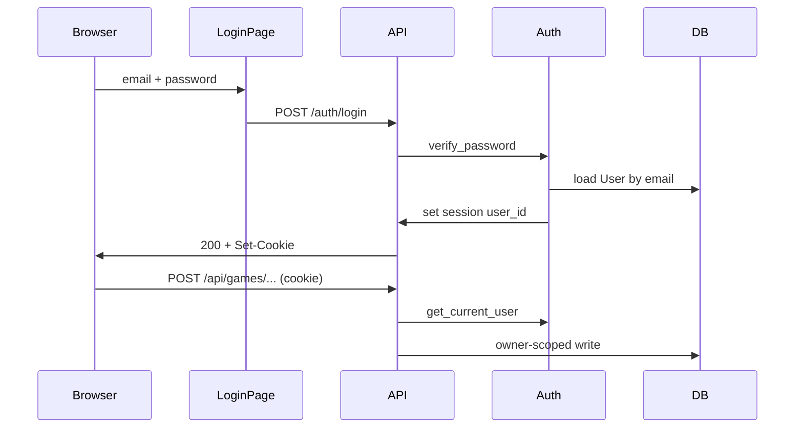
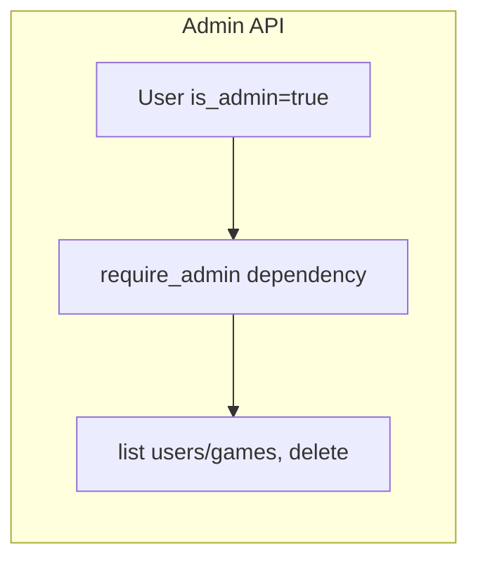
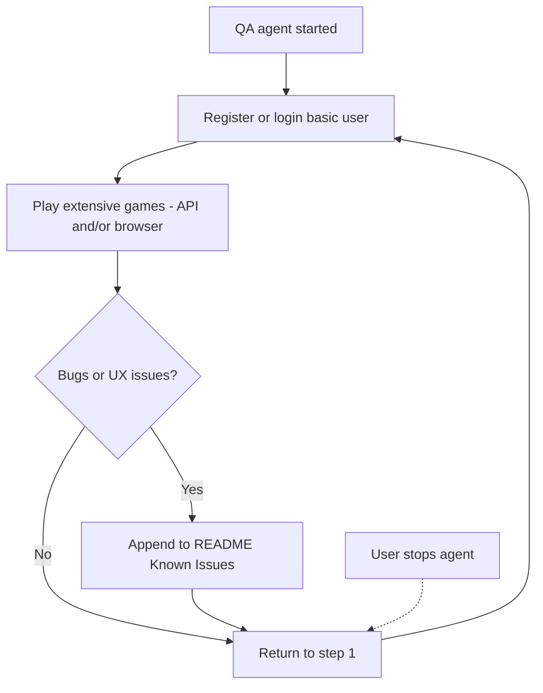

# Local auth, admin API, and QA automation

## Current state

- Auth is session-cookie based ([`backend/app/auth.py`](C:\dev\scrabble-helper\backend\app\auth.py)): Google OIDC via authlib, optional `DEV_AUTH_BYPASS` for tests.
- [`User`](C:\dev\scrabble-helper\backend\app\models.py) has `email`, `provider`, `provider_sub` — no password or role fields.
- All game APIs are owner-scoped via `get_owned_game()`; **no delete-game endpoint** exists.
- DB schema is created via `Base.metadata.create_all()` at startup — no Alembic revisions yet ([`backend/alembic/`](C:\dev\scrabble-helper\backend\alembic) is configured but empty).
- Production: SQLite on Fly volume; Google OAuth secrets on Fly.

## Architecture





## 1. Database and user model

**New columns on `users`** (Alembic revision `001_local_auth`):

| Column | Type | Purpose |
|--------|------|---------|
| `password_hash` | `String(255)`, nullable | Argon2 hash for `provider=local`; null for Google users |
| `is_admin` | `Boolean`, default false | Gates admin API |
| `totp_secret` | `String(255)`, nullable | **Unused in this phase** — reserved for future TOTP 2FA |

**Provider rules:**
- Google users: unchanged (`provider=google`, `provider_sub` = Google `sub`, `password_hash=null`)
- Local users: `provider=local`, `provider_sub=email`, `password_hash` set
- `email` remains globally unique — registration fails with 409 if email already used (including Google accounts)

**Migration strategy:**
- Add first Alembic revision; run `alembic upgrade head` in Docker `CMD` before uvicorn (or in [`lifespan`](C:\dev\scrabble-helper\backend\app\main.py)) so Fly SQLite gets new columns on deploy.
- Keep `create_all` as fallback for fresh test DBs.

## 2. Password security (local auth)

**Dependency:** `argon2-cffi` (no vendor; industry-standard memory-hard hashing).

**New module** [`backend/app/passwords.py`](C:\dev\scrabble-helper\backend\app\passwords.py):
- `hash_password(plain: str) -> str`
- `verify_password(plain: str, hashed: str) -> bool`
- `validate_password_policy(plain: str) -> None` — raises `ValueError` with user-facing message

**Policy (v1):**
- Min length 10
- At least one letter and one digit
- Max length 128 (DoS guard)

**Never** store plaintext passwords; never log passwords or hashes.

## 3. Auth endpoints

Extend [`backend/app/auth.py`](C:\dev\scrabble-helper\backend\app\auth.py) and wire in [`backend/app/main.py`](C:\dev\scrabble-helper\backend\app\main.py):

| Endpoint | Behavior |
|----------|----------|
| `POST /auth/register` | Body: `{ email, password, name }` — create local user, set session, return `UserOut` |
| `POST /auth/login` | Body: `{ email, password }` — verify, set session |
| `GET /auth/config` | Add `local_auth_enabled: true` (config flag, default on) |

**Error handling:** generic "Invalid email or password" on login failure (no account enumeration). Registration: 409 if email taken, 400 for weak password.

**Bootstrap admin** (on app startup, after migrations):
- New settings in [`backend/app/config.py`](C:\dev\scrabble-helper\backend\app\config.py): `admin_email`, `admin_password` (optional, from Fly secrets)
- If set: upsert user with `is_admin=true` and hashed password (create or update hash on deploy)
- Fly secrets: `ADMIN_EMAIL`, `ADMIN_PASSWORD` — **never in git**

## 4. Admin API (no UI — per your choice)

**New module** [`backend/app/admin.py`](C:\dev\scrabble-helper\backend\app\admin.py) + `require_admin` dependency:

| Endpoint | Purpose |
|----------|---------|
| `GET /api/admin/users` | List users: id, email, name, provider, game_count, is_admin |
| `GET /api/admin/games?owner_email=` | List games (optional filter by owner email) |
| `DELETE /api/admin/games/{game_id}` | Delete game + cascaded rounds/game_players |
| `DELETE /api/admin/users/{user_id}/games` | Bulk-delete all games for a user (your haaslogan1 cleanup) |

Lookup owner by email for convenience:
- `DELETE /api/admin/users/by-email/{email}/games` — resolves user id then bulk-deletes

**Authorization:** every admin route calls `require_admin` → 403 if not `is_admin`.

**Immediate cleanup after deploy:** admin logs in via `POST /auth/login`, then `DELETE /api/admin/users/by-email/haaslogan1@gmail.com/games`.

## 5. Frontend login/register

Update [`frontend/src/pages/LoginPage.tsx`](C:\dev\scrabble-helper\frontend\src\pages\LoginPage.tsx):
- Keep "Continue with Google" when configured
- Add email/password **Sign in** form → `POST /auth/login`
- Add **Create account** link/section → `POST /auth/register`
- Show server validation errors (parsed `detail` from API, reuse pattern from [`frontend/src/api.ts`](C:\dev\scrabble-helper\frontend\src\api.ts))

Extend `UserOut` / `AuthContext` with optional `is_admin` if useful later; not required for API-only admin.

**Terminology:** email/password users are **basic users** (`provider=local`). Google OIDC users remain unchanged.

## 6. QA automation — pytest + continuous QA agent

### 6a. Automated tests (CI gate)

**pytest fixtures** in [`backend/tests/conftest.py`](C:\dev\scrabble-helper\backend\tests\conftest.py):

```python
@pytest.fixture
def auth_client(client):
    """Register + login basic user; returns TestClient with session cookie."""
    ...

@pytest.fixture
def admin_client(client, monkeypatch):
    """Bootstrap admin via settings; login; returns admin TestClient."""
    ...
```

**New test files:**
- [`backend/tests/test_local_auth.py`](C:\dev\scrabble-helper\backend\tests\test_local_auth.py) — register, login, wrong password, duplicate email, weak password, admin authorization
- [`backend/tests/test_gameplay_qa.py`](C:\dev\scrabble-helper\backend\tests\test_gameplay_qa.py) — **extensive gameplay** as a basic user (see scenarios below)
- [`backend/tests/qa_gameplay.py`](C:\dev\scrabble-helper\backend\tests\qa_gameplay.py) — shared helper module: `register_basic_user()`, `play_full_game()`, `play_multi_round_game()`, etc., reusable by tests and documented for the QA agent

**CI** ([`.github/workflows/ci.yml`](C:\dev\scrabble-helper\.github\workflows\ci.yml)):
- Run auth + gameplay QA tests with `DEV_AUTH_BYPASS=false`
- Set `ADMIN_EMAIL` / `ADMIN_PASSWORD` test env vars for admin tests

### 6b. Extensive gameplay scenarios (basic user)

Each scenario runs via API (and optionally browser MCP against local or fly.dev) using `POST /auth/register` or `POST /auth/login` — never Google SSO, never `DEV_AUTH_BYPASS`.

| Area | Scenarios |
|------|-----------|
| **Auth** | Register basic user, login, logout, session persists across requests |
| **Roster** | Create players, duplicate name handling |
| **Game setup** | Settings wizard (points + words mode), attach players, turn order, random first, begin |
| **Live play** | Valid points (1, 42, 1786), invalid points (0, -1, decimal, empty, 1787), Enter-to-submit, challenge, skip, multi-player multi-round, standings update on submit, auto-advance to next player |
| **End game** | End active game, rack adjustments, finalize, winner/placement |
| **History** | Completed games list, game detail, rounds/scores correct |
| **Leaderboard** | Stats reflect completed games for basic user only (user-scoped) |
| **Edge cases** | Double-submit, resume in-progress game, hidden live leaderboard setting |

Vary data between runs (player names, scores, 2–4 players, multiple completed games) so the QA agent does not only repeat one path.

### 6c. Continuous QA agent (runs until you stop it)



**QA agent job** (verbatim workflow for the skill):

1. Create a non-SSO user (basic user) and play a ton of games.
2. Report issues to the README in **Known Issues** section.
3. You will review issues later and get a dev agent to work if necessary.
4. Return to step 1.

**Do not stop until you stop the QA agent.**

**Project skill:** [`.cursor/skills/scrabble-qa/SKILL.md`](C:\dev\scrabble-helper\.cursor\skills\scrabble-qa\SKILL.md)

- **Trigger:** User says "run QA", "QA agent", "gameplay testing", or starts a loop/automation for scrabble-helper testing
- **Target:** `https://scrabble-helper.fly.dev` (or local if user specifies); always authenticate as a **basic user**
- **Credentials:** Register a unique basic user per session (`qa+<timestamp>@test.local` + generated password) or reuse `QA_BASIC_EMAIL` / `QA_BASIC_PASSWORD` from env if set
- **Play:** Follow gameplay scenarios in 6b; prefer API for speed, use browser MCP when validating UI/timer/errors
- **Report:** Append to [`README.md`](C:\dev\scrabble-helper\README.md) **Known Issues** only — do not fix bugs during QA runs
- **Loop:** After each game batch, check for new issues, update README, then start another basic user or continue same user with more games
- **Stop condition:** Only when the user explicitly stops the agent/session — never self-terminate after N games

**Known Issues format** (add section to README during implementation):

```markdown
## Known Issues

_Reported by QA agent. Review and assign to dev agent as needed._

| Date | Reporter | Area | Summary | Steps to reproduce |
|------|----------|------|---------|-------------------|
```

Rules for the QA agent when writing entries:
- One row per distinct issue; skip if the same issue is already listed
- Include basic user email used (not password), game id if relevant, and exact steps
- Severity optional (blocker / major / minor)

**Optional:** Wire to Cursor Automations or `/loop` skill for unattended runs — document invocation in README under "QA agent".

### 6d. Agent / dev playbook (README)

1. Basic user: `POST /auth/register` or `POST /auth/login` with JSON body
2. Reuse session cookie on `fetch(..., credentials: 'include')` or `TestClient`
3. Admin cleanup: `POST /auth/login` as admin → `DELETE /api/admin/users/by-email/{email}/games`
4. Start QA agent: invoke scrabble-qa skill or say "run QA agent on scrabble-helper"

## 7. Future 2FA (design only — no implementation)

Zero-cost TOTP path (no Authy/Duo vendor):
- Use `pyotp` + standard authenticator apps
- `totp_secret` column stores **encrypted** secret (derive key from `SESSION_SECRET`)
- Login becomes two-step when enabled: password → `POST /auth/totp` with 6-digit code
- Optional recovery codes table in a later phase

No columns or endpoints beyond `totp_secret` nullable in this phase.

## 8. Housekeeping (same PR)

- Remove leftover debug instrumentation from [`frontend/src/pages/GamePlayPage.tsx`](C:\dev\scrabble-helper\frontend\src\pages/GamePlayPage.tsx) (`#region agent log` blocks)
- Remove debug log writes from [`backend/app/services.py`](C:\dev\scrabble-helper\backend\app\services.py) if still present

## 9. Deploy checklist

1. `fly secrets set ADMIN_EMAIL=... ADMIN_PASSWORD=...` (strong password)
2. Deploy — migrations add columns; startup ensures admin user
3. Admin login → bulk-delete `haaslogan1@gmail.com` games via admin API
4. Verify Google login still works for existing users

## Security notes (open registration)

- Open signup is enabled per your choice — monitor for abuse; consider rate limiting (`slowapi`) in a follow-up if needed
- No email verification in v1 — document as known limitation
- `SESSION_SECRET` must remain strong on Fly (already required)

## Files to touch (primary)

| Area | Files |
|------|-------|
| Model + migration | `models.py`, `alembic/versions/001_*.py`, `Dockerfile` or `lifespan` |
| Auth | `passwords.py`, `auth.py`, `config.py`, `schemas.py`, `main.py` |
| Admin | `admin.py`, `services.py` (delete helpers), `main.py` |
| Frontend | `LoginPage.tsx`, `api.ts`, optional `RegisterPage` or inline form |
| Tests + QA | `conftest.py`, `test_local_auth.py`, `test_gameplay_qa.py`, `qa_gameplay.py`, `ci.yml` |
| QA agent skill | `.cursor/skills/scrabble-qa/SKILL.md` |
| Docs | `README.md` (Known Issues + QA invocation) |
