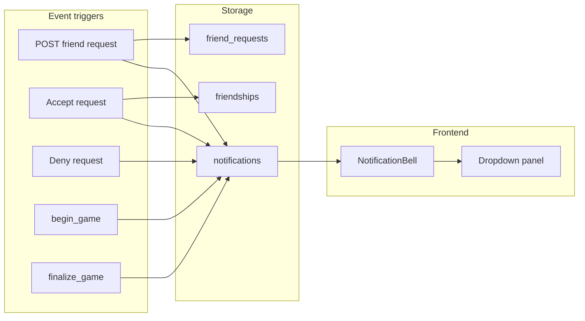

# Notification Bell and Friend Requests

## Decisions (locked in)

| Topic | Choice |
|-------|--------|
| Friend requests | **True pending requests** — no instant friendship; Accept creates mutual friendship + roster players; Deny rejects |
| Notification types (v1) | Friend request received, request accepted, request **declined**, live game started, game completed with you |
| Completed game link | `/games/:id` (game detail) |
| Live game link | `/game/:id/play` (spectate) |

## Architecture



## 1. Data model — migration `004_notifications_friend_requests`

New file: [`backend/alembic/versions/004_notifications_friend_requests.py`](backend/alembic/versions/004_notifications_friend_requests.py)

**`friend_requests`**
- `id`, `from_user_id`, `to_user_id`, `status` (`pending` | `accepted` | `declined`), `created_at`, `responded_at`
- `UNIQUE(from_user_id, to_user_id)`; index on `to_user_id` + `status`

**`notifications`**
- `id`, `user_id` (recipient), `type` (enum string), `title`, `body`, `payload` (JSON: `actor_user_id`, `game_id`, `friend_request_id`, etc.)
- `read_at`, `dismissed_at`, `created_at`
- Index on `(user_id, dismissed_at, created_at)`

**Legacy friendships:** Existing one-way `friendships` rows remain valid (grandfathered). New adds go through `friend_requests` only. `list_friends` continues to show users you follow; `mutual` still means both directions exist (via legacy rows or accepted request).

## 2. Backend — notifications module

New: [`backend/app/notifications.py`](backend/app/notifications.py)

Core helpers:
- `create_notification(db, user_id, type, title, body, payload)`
- `list_notifications(db, user_id, *, limit=50)` — exclude `dismissed_at` set
- `unread_count(db, user_id)` — `read_at IS NULL AND dismissed_at IS NULL`
- `mark_read(db, user_id, notification_id)`
- `dismiss(db, user_id, notification_id)`

**API** (add to [`backend/app/main.py`](backend/app/main.py)):

| Method | Path | Behavior |
|--------|------|----------|
| GET | `/api/notifications` | List recent notifications + unread count |
| GET | `/api/notifications/unread-count` | Badge number only (lightweight poll) |
| POST | `/api/notifications/{id}/read` | Mark read |
| POST | `/api/notifications/{id}/dismiss` | Dismiss (hide from list) |
| POST | `/api/notifications/{id}/accept` | Friend-request action only |
| POST | `/api/notifications/{id}/deny` | Friend-request action only |

Schemas in [`backend/app/schemas.py`](backend/app/schemas.py): `NotificationOut`, `NotificationListOut`.

## 3. Backend — refactor friends to true requests

Update [`backend/app/friends.py`](backend/app/friends.py):

**`send_friend_request(db, from_user_id, to_user_id)`** (replaces instant `add_friend` behavior)
- Reject if already mutual friends, pending request exists, or blocked state
- Insert `friend_requests` status `pending`
- Notify recipient: *"{name} sent you a friend request"* (`type: friend_request`)

**`accept_friend_request(db, user_id, request_id)`**
- Verify recipient, status `pending`
- Create **both** `Friendship` rows (mutual in one action)
- `ensure_friend_player` for both users
- Notify requester: *"{name} accepted your friend request"* (`friend_request_accepted`)
- Mark original notification read/dismissed

**`decline_friend_request(db, user_id, request_id)`**
- Set status `declined`
- Notify requester: *"{name} declined your friend request"* (`friend_request_declined`)
- Dismiss recipient notification

**`friend_mutual` notification:** Fired alongside `friend_request_accepted` only when the accept also completes a relationship the requester had been waiting on — in practice, **accept handler sends `friend_request_accepted`**; if we also want a separate “mutual friends” copy for the accepter, send a low-priority self-notification or skip (accept flow already satisfies the mutual-friend UX). Prefer **single accepted notification to requester** plus updating friends list for both; optional `friend_mutual` toast to accepter: *"You and {name} are now friends"* (`friend_mutual`).

Update routes:
- `POST /api/friends` → sends request (not instant follow)
- `POST /api/friends/requests/{id}/accept` and `/deny` (also callable via notification actions)
- `GET /api/friends/requests/incoming` for Find Friends pending section

Update [`frontend/src/pages/FindFriendsPage.tsx`](frontend/src/pages/FindFriendsPage.tsx): “Add” → “Send request”; show incoming pending requests with accept/deny.

## 4. Backend — game notification hooks

In [`backend/app/services.py`](backend/app/services.py):

**`begin_game`** (after commit):
- For each `GamePlayer` with `player.linked_user_id` set where host and linked user are mutual friends:
  - Notify linked user: *"{host} started a live game with you"* (`live_game_started`, `game_id`, link `/game/:id/play`)

**`finalize_game`** (after commit):
- Same linked participants (excluding host):
  - Notify: *"{host} completed a game you played in"* (`game_completed`, `game_id`, link `/games/:id`)

Only notify users with mutual friendship with host (consistent with live-play rules).

## 5. Frontend — bell UI

**New component:** [`frontend/src/components/NotificationBell.tsx`](frontend/src/components/NotificationBell.tsx)
- Bell icon + badge (unread count, cap display at `9+`)
- Click toggles dropdown anchored top-right (same pattern as [`UserMenu.tsx`](frontend/src/components/UserMenu.tsx): click-outside close)
- List items: title, body, relative time, type-specific actions
- Friend request row: **Accept** / **Deny** buttons
- Other types: tap row → navigate + mark read
- “Mark all read” optional footer link

**Header layout:** [`frontend/src/components/SiteHeader.tsx`](frontend/src/components/SiteHeader.tsx)

```tsx
<div className="site-header__actions">
  <NotificationBell />
  <UserMenu />
</div>
```

**Styles:** [`frontend/src/styles.css`](frontend/src/styles.css) — `.site-header__actions`, `.notification-bell`, badge, dropdown panel (match user-menu dropdown tokens).

**API client:** [`frontend/src/api.ts`](frontend/src/api.ts) — `getNotifications`, `getUnreadCount`, `markNotificationRead`, `dismissNotification`, `acceptFriendRequestFromNotification`, `denyFriendRequestFromNotification`.

**Polling:** On mount + every 60s (and on window focus) fetch unread count; full list fetched when panel opens.

## 6. Tests

New [`backend/tests/test_notifications.py`](backend/tests/test_notifications.py):
- Send request → recipient gets notification + unread count
- Accept via notification → mutual friendship, requester notified
- Deny → requester gets declined notification
- `begin_game` with linked mutual friend → `live_game_started` notification
- `finalize_game` → `game_completed` notification with correct `game_id`

Update [`backend/tests/test_friends.py`](backend/tests/test_friends.py) and [`backend/tests/test_friends_gameplay.py`](backend/tests/test_friends_gameplay.py) for request/accept flow instead of instant `add_friend`.

## 7. Cleanup (same PR or immediate follow-up)

Remove debug instrumentation from [`backend/app/auth.py`](backend/app/auth.py) (`_agent_log`, `AGENT_DEBUG`) — still present from SSO debug session.

## 8. Deploy

- Migration `004` runs on Fly startup (existing Alembic path; no `create_all` conflict)
- No Fly config changes for notifications (polling only in v1)

## Out of scope (v1)

- WebSocket push for notifications (poll is sufficient)
- Notification preferences / mute
- Retroactive notifications for pre-migration one-way friendships
- Long-running game warning notification (tracked in README Known Issues)
