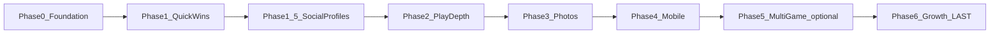

# Add Profile Pictures + Public Profiles to Roadmap

## Context

The canonical roadmap lives at [`product_roadmap_2026_36ec752e.plan.md`](c:\Users\haasl\.cursor\plans\product_roadmap_2026_36ec752e.plan.md). There is no `docs/ROADMAP.md` in the repo — future features are tracked in Cursor plan files.

**Current gaps (confirmed in codebase):**
- [`User`](c:\dev\scrabble-helper\backend\app\models.py) has no `avatar_url` field
- Google OAuth in [`auth.py`](c:\dev\scrabble-helper\backend\app\auth.py) stores `email`, `name`, `sub` but not Google's `picture`
- [`UserMenu.tsx`](c:\dev\scrabble-helper\frontend\src\components\UserMenu.tsx) shows a CSS initial only
- [`stats.py`](c:\dev\scrabble-helper\backend\app\stats.py) aggregates stats from **games you own**, scoped by your roster — no per-user public profile endpoint
- Friends/search UX exists at [`/friends`](c:\dev\scrabble-helper\frontend\src\pages\FindFriendsPage.tsx) but no `/users/:username` profile route

## Proposed placement: **Phase 1.5 — Social Profiles**

Insert between Phase 1 (Quick Wins) and Phase 2 (Play Depth):



**Rationale:** Friends, usernames, and user search are already shipped. Profile pictures and viewable stats are the natural next social layer and do not block Scrabble play-depth work. Deferring custom avatar **upload** to Phase 3 (R2/S3 photo infra) keeps Phase 1.5 small — Google picture URL + initials fallback for local users.

**Default privacy assumption** (document in impl plan; revisit at build time): any **signed-in** user can view profiles found via `@username` search. Stats show cross-game aggregates for the linked account. Email stays hidden.

---

## Roadmap file changes

Update [`product_roadmap_2026_36ec752e.plan.md`](c:\Users\haasl\.cursor\plans\product_roadmap_2026_36ec752e.plan.md):

### 1. Frontmatter todos — add two entries

```yaml
- id: phase1_5-avatars
  content: "Phase 1.5: Profile pictures (Google picture + Avatar component)"
  status: pending
- id: phase1_5-profiles
  content: "Phase 1.5: /users/:username profile page + GET /api/users/{username} stats"
  status: pending
```

### 2. New phase section (between Phase 1 and Phase 2)

| | |
|---|---|
| **Priorities** | #11 Profile pictures, #12 View other users' profiles + stats |
| **Duration** | ~1 week |
| **Outcome** | Avatars across app; tap a friend/username to see their Scrabble stats |
| **Implementation plan** | **[Phase 1.5 — Social Profiles (implementation)](phase1_5_social_profiles_impl.plan.md)** |

**High-level:**
- `User.avatar_url` column; populate from Google `picture` on OAuth login
- Reusable `Avatar` component (image or initial fallback)
- `GET /api/users/{username}` → `{ username, name, avatar_url, stats }`
- Stats aggregated across all **completed** games where `Player.linked_user_id` matches the target user
- Frontend `ProfilePage` at `/users/:username`; links from Find Friends, search results, and friend list

**Depends on:** Phase 1. **Blocks:** Phase 2.

### 3. Update dependency chain

- [`phase1_quick_wins_impl.plan.md`](c:\Users\haasl\.cursor\plans\phase1_quick_wins_impl.plan.md): change `blocks: [phase2]` → `blocks: [phase1_5]`
- [`phase2_play_depth_impl.plan.md`](c:\Users\haasl\.cursor\plans\phase2_play_depth_impl.plan.md): change `prerequisites: [phase1]` → `prerequisites: [phase1_5]`

### 4. Update ancillary sections

- Mermaid flowchart (add `P1_5` node)
- Plan file index table (add Phase 1.5 row)
- Cross-cutting concerns table: add row `Avatar + profile API | 1.5`
- Suggested timeline: slot Phase 1.5 in Q3 2026 alongside end of Phase 1
- Review checklist: add item confirming profile visibility policy

---

## New implementation plan to create

Create [`phase1_5_social_profiles_impl.plan.md`](c:\Users\haasl\.cursor\plans\phase1_5_social_profiles_impl.plan.md) following the established pattern (frontmatter todos, acceptance criteria, commits, file paths).

### Commit breakdown

| # | Task | Key files |
|---|------|-----------|
| 1 | DB migration: `users.avatar_url` nullable `String(512)` | `models.py`, Alembic `005_avatar_url` |
| 2 | OAuth: store Google `picture`; expose in `UserOut` / `Friend` schemas | `auth.py`, `schemas.py`, `api.ts` |
| 3 | `Avatar` component + wire into `UserMenu`, `FindFriendsPage`, friend requests | `components/Avatar.tsx`, `UserMenu.tsx`, `FindFriendsPage.tsx` |
| 4 | `user_profile_stats()` in `stats.py` — wins, games played, avg score, total points across linked games | `stats.py` |
| 5 | `GET /api/users/{username}` with auth gate + 404 for unknown username | `main.py` or new `profiles.py` |
| 6 | `ProfilePage` at `/users/:username` + navigation links | `ProfilePage.tsx`, `App.tsx` |
| 7 | Tests: OAuth picture persistence, profile API, stats aggregation, 403/404 cases | `test_profiles.py` |

### Stats model (new vs existing)

Existing [`/api/leaderboard`](c:\dev\scrabble-helper\backend\app\stats.py) answers: *"In games I completed, how did my roster perform?"*

New profile stats answer: *"Across all completed games where this user played as a linked player, what are their totals?"*

```python
# Conceptual query anchor (not final code)
select(GamePlayer, Game)
  .join(Player).join(Game)
  .where(
    Player.linked_user_id == target_user_id,
    Game.status == completed,
  )
```

Reuse existing metric helpers (`win_leaderboard`, `games_played`, etc.) refactored to accept a `linked_user_id` filter instead of `owner_user_id` roster scope.

### Out of scope for Phase 1.5

- Custom avatar upload (Phase 3 photo storage)
- Public (unauthenticated) profiles (Phase 6 growth)
- Per-game history on profile page (future enhancement)
- Profile editing beyond existing Settings username/name

### Acceptance criteria

- Google sign-in users get avatar from Google; local users see initial fallback
- Signed-in user can open `/users/{username}` and see name, avatar, and stats
- Unknown username → 404; unauthenticated → 401
- Find Friends list and search results link to profile page
- CI tests cover profile endpoint and stats aggregation

---

## What will NOT change

- No code changes in this step — roadmap/plan documentation only
- No renumbering of Phases 2–6 (Phase 1.5 label avoids churn)
- No `docs/ROADMAP.md` in repo unless you later ask for one (roadmap stays in Cursor plans per current workflow)
