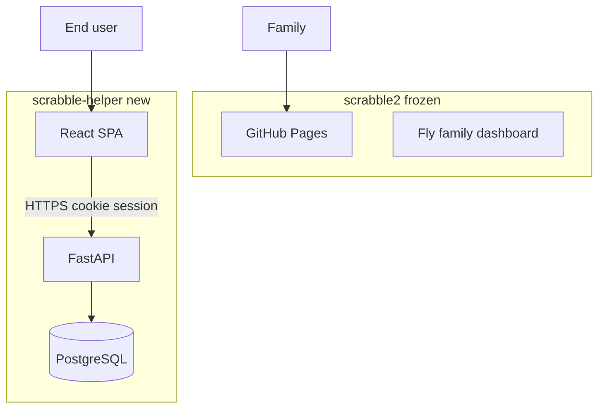
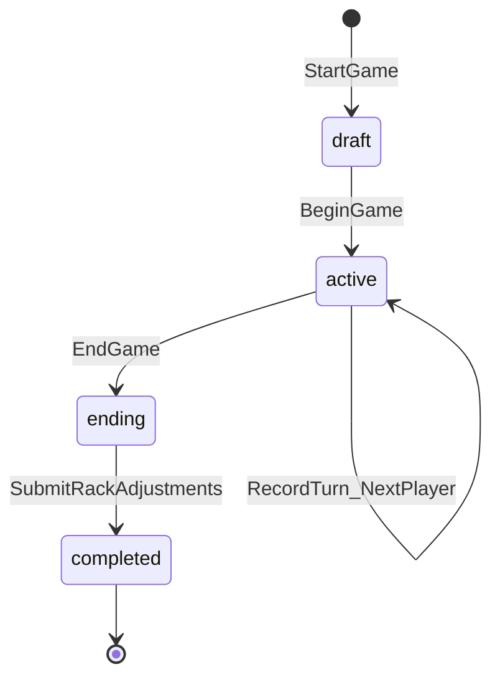

# Scrabble Helper — Productization Plan

## Executive decisions

| Question | Decision | Rationale |
|----------|----------|-----------|
| **Repo** | **New repo** (`scrabble-helper`); keep [`scrabble2`](C:\dev\scrabble2) unchanged | You want the family page live without spreadsheet import for end users. Copy reusable modules; no risk to production family site. |
| **Hosting** | **Stay on Fly.io + Docker** for v1 | You already have working deploy patterns. For "a few users," Fly + scale-to-zero is cost-effective. |
| **Database** | **PostgreSQL** (not SQLite) | Per-user private data, concurrent sessions, migrations. Use **Neon free tier** or **Supabase Postgres-only** ($0) — avoids Fly Postgres cost while keeping auth self-hosted. |
| **Auth** | **Self-hosted OIDC via authlib** (Google first; Facebook optional in v1.1) | Matches your preference; $0. Store `users` table keyed by `sub` + provider. Issue signed HTTP-only session cookie (or JWT). Document fallback to Supabase Auth if OAuth ops become painful. |
| **Frontend** | **React + TypeScript + Vite SPA** | Live game (timer, settings, multi-step wizard, game detail charts) exceeds what Jinja2 + Chart.js scales to cleanly. Build to `frontend/dist/`; FastAPI serves SPA + `/api/*`. |
| **Real-time** | **Single shared device v1**; no WebSockets yet | Server is source of truth; UI polls or refetches on "Next player." Schema leaves room for `game_events` table later. |
| **Legacy import** | **Not exposed in product** | Family keeps [`scrabble2`](C:\dev\scrabble2) + GitHub Pages. Optionally one-time admin script to copy your 12 games into your own account — not a user feature. |



---

## What to copy from scrabble2

Copy and adapt (with tests ported first):

- [`app/parse_game.py`](C:\dev\scrabble2\app\parse_game.py) — `assign_placements`, numeric/challenge semantics
- [`app/stats.py`](C:\dev\scrabble2\app\stats.py) — SQL aggregations; refactor to filter by `user_id` and read challenge/skip from DB instead of CSV
- [`static/style.css`](C:\dev\scrabble2\static\style.css) — design tokens / chart colors as starting point for leaderboard page
- Test patterns from [`tests/`](C:\dev\scrabble2\tests\) — fixtures, marker tiers, CI exclusions

Do **not** copy: Numbers pipeline, `build_static.py`, GitHub Pages workflow, volume-seed entrypoint pattern.

---

## Data model (PostgreSQL)

Extend the normalized model with ownership, lifecycle, and play metadata.

**New / changed entities:**

- `users` — `id`, `email`, `name`, `provider`, `provider_sub`, `created_at`
- `players` — add `owner_user_id` (user's saved player roster for dropdown)
- `games` — add `owner_user_id`, `status` (`draft` \| `active` \| `ending` \| `completed`), `settings` (JSONB), `started_at`, `completed_at`, `current_round`, `current_turn_index`; drop requirement for `source_file` on live games
- `game_players` — add `turn_order`, `rack_adjustment` (end-game penalty)
- `rounds` — add `play_type` (`score` \| `challenge` \| `skip`), optional `word` (when `input_mode=words`), `timer_elapsed_sec`

**Settings JSON (stored on game):**

```json
{
  "minutes_per_turn": 3,
  "input_mode": "points",
  "show_live_leaderboard": true
}
```

**Game state machine:**



---

## API surface (TDD targets)

All routes require auth except `/health`, `/auth/*`.

| Area | Endpoints |
|------|-----------|
| Auth | `GET /auth/login/google`, `GET /auth/callback/google`, `POST /auth/logout`, `GET /auth/me` |
| Home | `GET /api/home` — lightweight summary for dashboard cards |
| Players | `GET/POST /api/players`, search for dropdown |
| Live game | `POST /api/games` (settings), `PUT /api/games/{id}/players`, `POST /api/games/{id}/turn-order`, `POST /api/games/{id}/begin`, `POST /api/games/{id}/turns`, `POST /api/games/{id}/end`, `POST /api/games/{id}/finalize`, `GET /api/games/{id}/state` |
| History | `GET /api/games?status=completed`, `GET /api/games/{id}` (per-game stats) |
| Leaderboard | `GET /api/leaderboard` — same six metrics as today, scoped to `owner_user_id` |

Write tests before each endpoint using FastAPI `TestClient` + test Postgres (pytest-docker or transaction rollbacks).

---

## Frontend routes (React Router)

| Route | Screen |
|-------|--------|
| `/` | Home — Start Game, Review Past Games, Leaderboard |
| `/login` | Redirect to Google OAuth |
| `/game/new` | Settings wizard |
| `/game/new/players` | Player picker (dropdown + add new) |
| `/game/new/order` | Random first player + manual turn order |
| `/game/:id/play` | Live board — timer, score/word input, live leaderboard (optional hidden), "Next player", "End game" |
| `/game/:id/end` | Rack / leftover letter penalties per player |
| `/games` | Past games list (date, winner) |
| `/games/:id` | Per-game analytics (tables + Chart.js/Recharts) |
| `/leaderboard` | All-time analytics (port of current dashboard) |

---

## TDD + Agile delivery (6 sprints)

### Sprint 1 — Foundation (1–2 weeks)
- Bootstrap `scrabble-helper` repo: FastAPI, Alembic, PostgreSQL, pytest CI, Docker, `fly.toml`
- **Tests first:** auth callback mock, `users` CRUD, health, session middleware
- Google OIDC login end-to-end locally
- Empty authenticated home shell in React

### Sprint 2 — Player roster (1 week)
- **Tests:** create/list players scoped to user; cannot read other users' players
- API + React player dropdown component
- DB migrations for `players`, `users`

### Sprint 3 — Game setup wizard (1–2 weeks)
- **Tests:** create game with settings JSON; attach players; random first + reorder turn order; state transitions
- Screens: Settings → Players → Turn order → Begin

### Sprint 4 — Live play loop (2 weeks)
- **Tests:** record turn (points/words/challenge/skip); advance turn index; timer metadata; optional hidden running totals; authorization on game ownership
- Play screen with manual "Proceed to next player" (no auto-advance)
- Refetch game state after each action

### Sprint 5 — End game + history (1–2 weeks)
- **Tests:** rack adjustments; finalize placements via `assign_placements`; completed games appear in list
- End-game flow + per-game detail stats page
- Back navigation: detail → list → home

### Sprint 6 — Leaderboard + launch (1 week)
- Port stats queries from [`app/stats.py`](C:\dev\scrabble2\app\stats.py) with user scope + DB-backed challenge counts
- Leaderboard page with charts (Recharts or Chart.js)
- Fly deploy to new app; domain `scrabblehelper.com` via `fly certs add` + DNS (register domain if not owned)
- Production smoke tests

**Agile practices:** vertical slices per sprint, demoable at end of each; backlog grooming for Facebook OAuth, multi-device sync, and invite-to-game as post-v1 epics.

---

## Project layout (new repo)

```
scrabble-helper/
  backend/
    app/
      main.py, auth/, db/, models/, routes/, services/, stats.py, scoring.py
    alembic/
    tests/
  frontend/
    src/pages/, components/, api/
  Dockerfile
  docker-compose.yml   # api + postgres for local dev
  fly.toml
  .github/workflows/ci.yml
```

Monorepo keeps one Docker image (multi-stage: build frontend, copy into FastAPI static).

---

## Domain and deployment

- Register **scrabblehelper.com** (or chosen name) if not owned
- New Fly app: `scrabble-helper` (separate from `haas-family-scrabble-results`)
- Env secrets: `DATABASE_URL`, `GOOGLE_CLIENT_ID`, `GOOGLE_CLIENT_SECRET`, `SESSION_SECRET`
- Remove scale-to-zero for API if cold starts annoy live games (`min_machines_running = 1` on game nights) — optional cost knob

---

## Cost estimate (few users)

| Item | v1 cost |
|------|---------|
| Fly.io app (512MB, scale-to-zero) | ~$0–5/mo |
| Neon Postgres free tier | $0 |
| Google OAuth | $0 |
| Domain `.com` | ~$12/yr |
| Clerk/Supabase Auth | **Not used in v1** |

---

## Risks and mitigations

- **Self-hosted OAuth complexity** — use well-tested `authlib` + httpx; integration tests with mocked token exchange; fallback doc for Supabase Auth
- **SQLite on Fly volume** — explicitly avoided; Postgres from sprint 1
- **Scope creep (multi-device sync)** — defer; design `game_events` table in sprint 4 backlog only
- **Stats parity with family site** — port logic with tests comparing fixture outputs to scrabble2 expected values

---

## Immediate next steps after plan approval

1. Create `scrabble-helper` repo and CI scaffold
2. Write failing tests for auth + user model
3. Set up Google Cloud OAuth credentials (redirect URI for local + Fly)
4. Copy `parse_game` / `stats` with user-scoping refactor plan in tests
