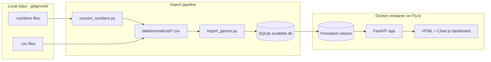

# Scrabble Results Website Plan

## What we found in your data

| Location | Files |
|---|---|
| [`C:\dev\scrabble\input\2025`](C:\dev\scrabble\input\2025) | 1 CSV + 7 `.numbers` |
| [`C:\dev\scrabble\input\2026`](C:\dev\scrabble\input\2026) | 5 `.numbers` |

**Confirmed sheet format** (validated by reading `.numbers` with `numbers-parser`):

- Row 0: player names (`Granddad`, `Logan`, `Dad`, etc.)
- Rows 1+: one round per row; cell = that player's score for the round
- Trailing empty columns/rows are common and must be ignored
- Some files include a **totals row** at the bottom (e.g. `[156, 169, 87]` in `Scrabble_June_26_2026.numbers`); older 2025 files do not
- `0` in a cell = failed challenge (count toward "challenges lost")
- Negative scores exist (penalties) and are valid round scores

Example existing CSV ([`Scrabble_10_27_2025.csv`](C:\dev\scrabble\input\2025\Scrabble_10_27_2025.csv)):

```csv
Madison,Granddad,Logan,,,
8,14,20,,,
...
5,-2,-1,,,
```

**Environment notes:**

- No git repo yet at `C:\dev\scrabble`
- Docker Desktop not installed (you chose to install it)
- `numbers-parser` installs and reads your files on Python 3.9 (tested successfully)
- `gh` CLI not installed — we'll use git + GitHub web/CLI setup during implementation
- **GitHub username:** you indicated you'll provide it in chat before we create the remote repo

---

## Architecture



**Why this stack:**

- **SQLite** satisfies lightweight DB + reduced file I/O (one import, many fast queries)
- **Docker + Fly.io volume** gives persistent DB across deploys without re-parsing files on every request
- **FastAPI + Jinja2 + Chart.js** keeps the site simple, beautiful, and easy to maintain — no heavy frontend build step
- **Sidecar CSV conversion** preserves originals; normalized CSVs are reproducible build artifacts (gitignored like `input/`)

---

## Project layout (new repo at `C:\dev\scrabble`)

```
scrabble/
├── .gitignore              # input/, data/normalized/, *.db, .env
├── README.md               # setup, import, deploy, test instructions
├── requirements.txt        # runtime deps
├── requirements-dev.txt    # pytest, httpx, pytest-cov
├── pytest.ini              # test paths, markers
├── docker-compose.yml      # local dev
├── Dockerfile
├── fly.toml                # Fly.io deploy config
├── .github/workflows/
│   └── ci.yml              # run pytest on every push
├── scripts/
│   ├── convert_numbers.py  # .numbers → sidecar CSV (never touches originals)
│   └── import_games.py     # normalized CSV → SQLite
├── app/
│   ├── main.py             # FastAPI routes
│   ├── db.py               # SQLite connection + queries
│   ├── stats.py            # leaderboard, averages, challenges
│   ├── parse_game.py       # CSV parsing + sum-row detection
│   └── templates/
│       └── index.html      # dashboard
├── static/
│   └── style.css
└── tests/
    ├── conftest.py         # shared fixtures (tmp dirs, in-memory DB, TestClient)
    ├── fixtures/           # committed mini CSVs + expected JSON (no real input/)
    │   ├── game_no_sum.csv
    │   ├── game_with_sum.csv
    │   ├── game_empty_rows.csv
    │   ├── game_tie.csv
    │   └── game_challenges.csv
    ├── test_convert_numbers.py
    ├── test_parse_game.py
    ├── test_import_games.py
    ├── test_stats.py
    ├── test_api.py
    └── test_e2e_smoke.py   # optional; runs against docker-compose
```

`input/` stays where it is; repo references it via configurable path (`SCRABBLE_INPUT_DIR`, default `./input`).

---

## Test-Driven Development (mandatory)

Every feature phase follows **red → green → refactor**:

1. Write a failing test that describes the expected behavior
2. Implement the minimum code to pass
3. Refactor while keeping tests green
4. Commit tests and implementation in separate small commits when practical (tests first, then code)

**Test stack:** `pytest` + `httpx` (FastAPI `TestClient`) + in-memory/temp SQLite + committed fixture files in `tests/fixtures/` (synthetic data only — never commit real `input/` files).

**CI gate:** GitHub Actions workflow (`.github/workflows/ci.yml`) runs `pytest` on every push/PR. No phase is "done" until CI is green.

**Markers:**

- `@pytest.mark.unit` — pure logic, no I/O
- `@pytest.mark.integration` — DB, file system, import scripts
- `@pytest.mark.golden` — regression against real local files (run locally only; skipped in CI unless `SCRABBLE_INPUT_DIR` is set)

**Local commands:**

```powershell
pip install -r requirements-dev.txt
pytest                          # full suite
pytest tests/test_parse_game.py # single module
pytest -m "not golden"          # CI-equivalent (no real input/)
pytest --cov=app --cov=scripts  # coverage report
```

---

## Phase 1: Prerequisites and repo bootstrap

1. **Install Docker Desktop** on Windows (WSL2 backend) — required for deployment and optional for local dev
2. **Initialize git** at `C:\dev\scrabble`:
   - `.gitignore`: `input/`, `data/normalized/`, `data/*.db`, `__pycache__/`, `.venv/`
3. **Create GitHub repo** `scrabble` (or your preferred name) under your username once you provide it
4. Small initial commits (no co-author trailers):
   - `chore: add project skeleton and gitignore`
   - `chore: add python dependencies`
   - `test: add pytest scaffold and CI workflow`

### Testing / validation (Phase 1)

| Step | Test / validation |
|---|---|
| pytest runs | `pytest` exits 0 with a single placeholder test (`test_scaffold.py::test_true`) |
| CI wired | Push triggers GitHub Actions; workflow passes on empty/green suite |
| Dev deps | `requirements-dev.txt` pins pytest, httpx, pytest-cov |
| Fixtures dir | `tests/fixtures/` created with README noting synthetic-only policy |

---

## Phase 2: Conversion script (`.numbers` → CSV, no data mutation)

**Script:** [`scripts/convert_numbers.py`](scripts/convert_numbers.py)

Behavior:

- Walk `input/{year}/` for `*.numbers` and `*.csv`
- For each `.numbers` file:
  - Read table 0 via `numbers-parser` `Document`
  - Write **new file** to `data/normalized/{year}/{basename}.csv` (never overwrite source)
  - Export raw cell values as CSV strings; `None` → empty field
- For existing `.csv` files: copy verbatim to `data/normalized/` (byte-for-byte) for a uniform import path
- **Validation pass:** after converting `Scrabble_11_11_2025.numbers`, spot-check row counts and player names; optionally diff against manual export if you provide one later
- Print summary: converted / skipped / errors

**TDD order:** write `tests/test_convert_numbers.py` first, then implement.

**Commits:**

- `test: add conversion script tests`
- `feat: add numbers-to-csv conversion script`

### Testing / validation (Phase 2)

| Test | What it asserts |
|---|---|
| `test_copy_csv_verbatim` | Existing `.csv` copied byte-for-byte to `data/normalized/`; source mtime/content unchanged |
| `test_numbers_writes_sidecar_only` | `.numbers` input produces new CSV in `data/normalized/`; original `.numbers` byte hash unchanged |
| `test_none_cells_become_empty_fields` | Mock/small `.numbers` fixture: `None` cells export as empty CSV fields |
| `test_skips_already_converted` | Re-run is idempotent (skip or overwrite normalized only, never source) |
| `test_invalid_file_logs_error` | Corrupt path returns error in summary, does not crash batch |
| `test_convert_real_file` *(golden, local)* | Convert one real file (`Scrabble_11_11_2025.numbers`); assert player row matches `['Granddad','Logan','Dad']` and round count ≥ 12 |

**Manual validation:** diff `data/normalized/` against nothing in `input/` — confirm no source files touched (checksum before/after).

---

## Phase 3: Game parsing and SQLite import

### Parsing rules ([`app/parse_game.py`](app/parse_game.py))

1. Row 0 → player names (trim whitespace; ignore empty name columns)
2. Subsequent rows → rounds; **skip row if all player cells are empty**
3. Per cell: empty → ignore; numeric (int or float) → round score; non-numeric → log warning, skip cell
4. **Totals row detection** (bottom-up):
   - Find last row with ≥2 numeric values in player columns
   - If those values equal the computed column sums of all round rows above → treat as totals row (not a round)
   - Otherwise compute totals by summing rounds per player
5. **Winner / placement:** rank players by total score descending; ties share the same rank (each tied 1st gets a win credit)
6. **Date extraction** from filename + year folder:
   - Patterns: `Scrabble_10_27_2025`, `Scrabble_11_22` (+ folder year), `Mar30_Scrabble`, `April2nd_Scrabble`, `Scrabble_June_26_2026`
   - Unparseable filenames → import with `date=NULL` and flag in import log for manual fix

### SQLite schema

```sql
players       (id, name UNIQUE)
games         (id, played_date, source_file, year_folder)
game_players  (game_id, player_id, total_score, placement, won BOOLEAN)
rounds        (game_id, player_id, round_number, score)
```

Indexes on `games.played_date`, `rounds(game_id, player_id)`.

**Script:** [`scripts/import_games.py`](scripts/import_games.py)

- Idempotent: re-import skips or upserts by `source_file` hash
- Logs: games imported, warnings (unparseable dates, sum mismatch)

**TDD order:** `tests/test_parse_game.py` → `tests/test_import_games.py` → implement `parse_game.py` → implement import.

**Commits:**

- `test: add game parsing and import tests`
- `feat: add sqlite schema and game import pipeline`

### Testing / validation (Phase 3)

**Fixture files in `tests/fixtures/`** (hand-authored, cover edge cases):

| Fixture | Covers |
|---|---|
| `game_no_sum.csv` | Totals computed from rounds (mirrors early 2025 format) |
| `game_with_sum.csv` | Bottom totals row detected and excluded from round count |
| `game_empty_rows.csv` | All-empty rows ignored mid-game and at end |
| `game_tie.csv` | Two players tie for 1st → both get `won=true`, same placement |
| `game_challenges.csv` | `0` scores stored as valid round scores (for later challenge stat) |

**Unit tests (`test_parse_game.py`):**

| Test | Assertion |
|---|---|
| `test_parse_players_row` | Names trimmed; empty columns dropped |
| `test_skip_empty_round_rows` | Row of all empties not counted as a round |
| `test_parse_negative_scores` | `-2`, `-1` accepted as round scores |
| `test_detect_sum_row` | Last row matching column sums → not a round; totals used |
| `test_no_sum_row_computes_totals` | Sum of rounds equals `total_score` per player |
| `test_sum_row_mismatch_warns` | Totals row present but wrong → warn + use computed sum |
| `test_parse_date_from_filename` | Parametrized: `Scrabble_10_27_2025`, `Scrabble_11_22`+folder, `Mar30_Scrabble`, `April2nd_Scrabble` |
| `test_unparseable_date_returns_none` | Bad filename → `date=None`, warning logged |

**Integration tests (`test_import_games.py`):**

| Test | Assertion |
|---|---|
| `test_import_creates_schema` | Tables + indexes exist in temp DB |
| `test_import_single_fixture` | 1 game, correct player/round/game_players row counts |
| `test_import_idempotent` | Second import of same file does not duplicate games |
| `test_winner_placement` | Highest total → `won=true`; tie case from `game_tie.csv` |
| `test_import_all_fixtures` | 5 fixtures → expected game count in DB |

**Golden test (local only):** import all 12 real files from `input/`; assert 12 games, 0 hard errors, log warnings reviewed manually.

---

## Phase 4: Stats layer and dashboard

### Stats ([`app/stats.py`](app/stats.py)) — your six requirements

| # | Stat | Query logic |
|---|---|---|
| 1 | **Win leaderboard** | Count games where `game_players.won = true` |
| 2 | **Total points bar chart** | `SUM(total_score)` per player across all games |
| 3 | **Avg points per play** | `SUM(round scores) / COUNT(rounds)` per player |
| 4 | **Avg total points per game** | `AVG(total_score)` per player (games they played) |
| 5 | **Challenges lost** | `COUNT(rounds)` where `score = 0` |
| 6 | **Games played bar chart** | `COUNT(DISTINCT game_id)` per player |

### Web UI ([`app/templates/index.html`](app/templates/index.html))

- Clean, responsive single-page dashboard (modern CSS — system fonts, card layout, subtle color palette)
- **Chart.js** bar charts for stats #2 and #6
- Sortable tables for leaderboard and per-player breakdown
- Optional game list section (date, players, winner, scores) — useful context, low extra effort
- No authentication (public read-only site)

**TDD order:** seed in-memory DB in `conftest.py` with known values → write `tests/test_stats.py` → implement `stats.py` → write `tests/test_api.py` → implement routes/templates.

**Commits:**

- `test: add stats query tests`
- `feat: add player stats queries`
- `test: add API and dashboard tests`
- `feat: add dashboard UI with charts`

### Testing / validation (Phase 4)

**Seeded test DB** (built in `conftest.py` from fixtures, known ground truth):

- 3 players: A, B, C
- 2 games with deterministic scores, 1 tie game, known `0`-score challenge cells
- Expected values pre-calculated by hand in test constants

**Stats tests (`test_stats.py`) — one test per requirement:**

| Test | Stat # | Expected (from seeded DB) |
|---|---|---|
| `test_win_leaderboard` | 1 | Player win counts match hand-calculated totals |
| `test_total_points_all_time` | 2 | `SUM(total_score)` per player |
| `test_avg_points_per_play` | 3 | total round points / round count (empty cells excluded) |
| `test_avg_total_points_per_game` | 4 | `AVG(total_score)` over games played |
| `test_challenges_lost` | 5 | Count of rounds where `score == 0` |
| `test_games_played` | 6 | Distinct game count per player |

**API tests (`test_api.py`):**

| Test | Assertion |
|---|---|
| `test_get_stats_json` | `GET /api/stats` returns 200 + all 6 stat arrays with correct keys |
| `test_get_games_list` | `GET /api/games` returns imported games sorted by date |
| `test_index_html_renders` | `GET /` returns 200, contains player names and chart canvas elements |
| `test_static_css_served` | `GET /static/style.css` returns 200 |

**Manual validation:** open `http://localhost:8080` — visually confirm bar charts render and tables sort correctly (not automatable without browser E2E; optional future Playwright addition).

---

## Phase 5: Docker and local dev

**[`docker-compose.yml`](docker-compose.yml):**

- Service `web`: builds from `Dockerfile`, exposes `:8080`
- Volume mount: `./data/scrabble.db` (persistent)
- Startup: run import if DB missing or `IMPORT_ON_START=1`

**[`Dockerfile`](Dockerfile):**

- Python 3.11 slim base
- Install deps, copy app
- `CMD`: import (optional) + `uvicorn app.main:app --host 0.0.0.0 --port 8080`

Local workflow:

```powershell
python scripts/convert_numbers.py
python scripts/import_games.py
docker compose up --build
# → http://localhost:8080
```

**Commits:**

- `test: add docker smoke tests`
- `feat: add docker compose for local development`

### Testing / validation (Phase 5)

| Test / check | Assertion |
|---|---|
| `test_dockerfile_builds` | `docker build .` succeeds locally |
| `test_compose_health` *(integration)* | `docker compose up -d` → `GET /health` (or `/api/stats`) returns 200 within 30s |
| `test_db_persists_across_restart` | Stop/start container; data still present on mounted volume |
| `test_import_on_start` | With empty volume + `IMPORT_ON_START=1`, DB populated from normalized CSVs |
| CI note | Docker smoke tests run locally only (not in GitHub Actions unless Docker-in-Docker added later) |

**Manual validation:** full local workflow from README — convert → import → compose up → dashboard loads with real stats.

---

## Phase 6: Deploy to Fly.io (recommended — simple Docker + persistent volume)

Why Fly.io: free tier, native Docker deploy, persistent volumes for SQLite, minimal config.

Steps (during implementation):

1. Install `flyctl` CLI
2. `fly launch` in project (no Dockerfile override needed)
3. Create volume: `fly volumes create scrabble_data --size 1`
4. Mount volume at `/data` in `fly.toml`; set `DATABASE_PATH=/data/scrabble.db`
5. One-time remote import: `fly ssh console` → run import script, or bake initial DB into first deploy
6. Custom domain optional later via Fly DNS

**Commits:**

- `feat: add fly.io deployment config`
- `test: add production smoke test script`

### Testing / validation (Phase 6)

| Check | How |
|---|---|
| Deploy succeeds | `fly deploy` exits 0; `fly status` shows healthy machine |
| Health endpoint | `curl https://<app>.fly.dev/health` → 200 |
| Stats endpoint | `curl https://<app>.fly.dev/api/stats` → JSON with 6 stat sections, non-empty after import |
| Volume mounted | Re-deploy does not wipe DB; stats unchanged |
| `scripts/smoke_test.sh` | Runnable script (httpx or curl) checks `/`, `/api/stats`, `/api/games` against `BASE_URL` env var — run post-deploy |

---

## Phase 7: GitHub workflow and ongoing updates

When you add new game files:

1. Drop file in `input/{year}/`
2. Run `convert_numbers.py` then `import_games.py` locally
3. Deploy updated container (or sync DB to Fly volume)
4. Small commit if code changed; **game data stays local** (gitignored)

Suggested commit discipline (throughout):

- One logical change per commit
- Messages like `feat: ...`, `fix: ...`, `chore: ...`, `test: ...`
- No `Co-authored-by` trailers
- **Tests before or with each feature commit** — never merge implementation without corresponding tests

### Testing / validation (Phase 7 — ongoing)

When adding a new game file:

1. Run `pytest -m "not golden"` (must pass)
2. Run golden import locally on full `input/` (review warnings)
3. Run `scripts/smoke_test.sh` against local and production URLs
4. Spot-check one stat manually (e.g. win count changed as expected)

---

## Phase 8: Full data regression (final gate)

Run once after all phases, before calling the site "live."

| Check | Pass criteria |
|---|---|
| Convert all 12 files | 11 `.numbers` + 1 `.csv` → 12 normalized CSVs; zero source modifications |
| Import all 12 files | 12 games in DB; import log reviewed |
| Stats sanity | Hand-verify win leaderboard against known outcomes for 2–3 games you remember |
| Public URL | Production smoke script green |
| CI | GitHub Actions green on `main` |

---

## Risks and mitigations

| Risk | Mitigation |
|---|---|
| `.numbers` conversion alters values | Write to separate `data/normalized/` only; never edit `input/`; log checksums; you have backups |
| Sum row mis-detected | Validate totals row against computed sums; warn on mismatch; fall back to computed sum |
| Ambiguous dates (`Scrabble_11_22.numbers`) | Use folder year (`2025`); flag unparseable names in import log |
| Player name variants (`Dad` vs `Granddad`) | Treat as distinct players unless you tell us to merge aliases |
| Fly.io volume empty on first deploy | Document one-time import into production volume |
| Tied winners | Each player at max score gets +1 win (standard co-win) |

---

## Before implementation starts

Please send your **GitHub username** in chat so we can create the remote repo with the correct owner.

Optional clarifications (defaults shown if you don't care):

- **Repo name:** `scrabble` (default)
- **Tied games:** each top scorer gets a win (default)
- **Player aliases:** no merging unless you specify (e.g. "Dad = Logan")
