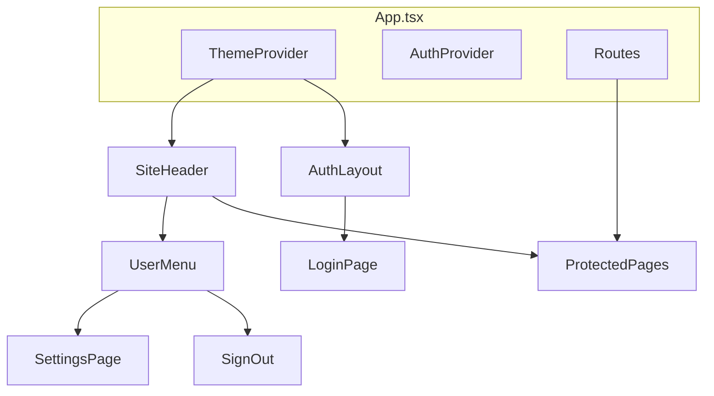

# UI Overhaul Plan

## Goals

Fix the three auth/nav pain points and deliver a cohesive visual refresh inspired by [playscrabble.com](https://playscrabble.com/) (clean, game-focused, card-based) and the existing dark theme in [`c:\dev\scrabble\static\style.css`](c:\dev\scrabble\static\style.css).

## Architecture

**Layout rules:**
- `/login` uses `AuthLayout` only — **no global nav**, so the stray `<a href="/login">Scrabble Helper</a>` from [`App.tsx`](frontend/src/App.tsx) `NavBar` disappears on auth.
- All authenticated routes use `AppShell`: fixed top header + main content area.
- User controls live **top-right** in a dropdown menu (not the current inline `` + Sign out row).

## 1. Theme system (system default + Settings override)

**New:** [`frontend/src/theme/ThemeContext.tsx`](frontend/src/theme/ThemeContext.tsx)

- Resolve theme on load: `localStorage.theme` if set (`"light"` | `"dark"`), else `prefers-color-scheme`.
- Apply `data-theme="light"|"dark"` on `<html>` in [`main.tsx`](frontend/src/main.tsx).
- Listen to `matchMedia('(prefers-color-scheme: dark)')` when no manual override is stored.
- Expose `{ theme, setTheme, resetToSystem }` for Settings.

**CSS variables** in [`frontend/src/styles.css`](frontend/src/styles.css):

| Token | Light (playscrabble-inspired) | Dark (scrabble project) |
|-------|------------------------------|-------------------------|
| `--bg` | warm off-white / soft gradient | `#0f1419` radial gradient |
| `--card` | white with subtle shadow | `#1a2332` gradient + border |
| `--accent` | Scrabble green `#0f6b4d` | teal `#2a9d8f` |
| `--text`, `--muted`, `--border` | light-theme grays | from scrabble `style.css` |

Shared component classes replace inline styles: `.btn`, `.btn-google`, `.btn-secondary`, `.input`, `.auth-card`, `.site-header`, `.user-menu`, `.tile-grid` (home action cards), `.page-title`, `.error-text`.

Chart.js colors in [`LeaderboardPage.tsx`](frontend/src/pages/LeaderboardPage.tsx) will read accent palette from CSS variables (via `getComputedStyle`) so charts match the active theme.

## 2. Header and user menu (top-right)

**New components:**
- [`frontend/src/components/SiteHeader.tsx`](frontend/src/components/SiteHeader.tsx) — full-width bar, brand link left (`Scrabble Helper` → `/`), user menu right.
- [`frontend/src/components/UserMenu.tsx`](frontend/src/components/UserMenu.tsx) — avatar initial + name button; dropdown with:
  - User name + email (read-only)
  - **Settings** → `/settings`
  - **Sign out**

**Update:** [`frontend/src/App.tsx`](frontend/src/App.tsx)
- Wrap authenticated routes in `AppShell` (header + `<main class="container">`).
- Render login route outside `AppShell` (no header).
- Remove current `NavBar` inline user/sign-out layout.

## 3. Settings page

**New:** [`frontend/src/pages/SettingsPage.tsx`](frontend/src/pages/SettingsPage.tsx)

- Account section: display name, email (from `useAuth()`).
- Appearance section: theme selector — **System** (default), **Light**, **Dark**.
- Route: `/settings` behind `ProtectedRoute`.

No backend changes; preference is client-only (`localStorage`).

## 4. Auth page fixes

**New:** [`frontend/src/components/AuthLayout.tsx`](frontend/src/components/AuthLayout.tsx) — centered full-viewport layout with branded hero (title + tagline), no nav chrome.

**New:** [`frontend/src/components/GoogleSignInButton.tsx`](frontend/src/components/GoogleSignInButton.tsx)
- White button with border, official multicolor Google "G" SVG inline (no external asset dependency).
- Links to `/auth/login/google` as today.

**Update:** [`frontend/src/pages/LoginPage.tsx`](frontend/src/pages/LoginPage.tsx)
- Use `AuthLayout` + `.auth-card`.
- Replace raw `<a class="btn">Continue with Google</a>` with `GoogleSignInButton`.
- Move inline styles to CSS classes (largest inline-style cleanup in the app).

## 5. Visual overhaul across pages

Apply the new design system consistently (mostly class renames + removing inline styles; no logic changes):

| Page | Changes |
|------|---------|
| [`HomePage.tsx`](frontend/src/pages/HomePage.tsx) | Hero + 3 action tiles (Start Game, Past Games, Leaderboard) styled like playscrabble feature cards |
| [`GameSettingsPage.tsx`](frontend/src/pages/GameSettingsPage.tsx) | Form layout with new inputs/buttons |
| [`GamePlayPage.tsx`](frontend/src/pages/GamePlayPage.tsx) | Prominent timer, action button row, standings table |
| [`LeaderboardPage.tsx`](frontend/src/pages/LeaderboardPage.tsx) | Match scrabble project card/grid layout; themed charts |
| [`GamesListPage.tsx`](frontend/src/pages/GamesListPage.tsx), game flow pages | Card list styling, remove ad-hoc inline styles |

[`frontend/index.html`](frontend/index.html): add `color-scheme` meta support via CSS; optional Google Font (e.g. similar to playscrabble's clean sans — keep system stack if preferred for zero network deps).

## 6. Files touched (summary)

**Create (6):** `ThemeContext.tsx`, `SiteHeader.tsx`, `UserMenu.tsx`, `GoogleSignInButton.tsx`, `AuthLayout.tsx`, `SettingsPage.tsx`

**Modify (10+):** `App.tsx`, `main.tsx`, `styles.css`, `LoginPage.tsx`, `HomePage.tsx`, `LeaderboardPage.tsx`, `GamePlayPage.tsx`, `GameSettingsPage.tsx`, `GamesListPage.tsx`, remaining game pages (minor class updates)

**No backend changes.**

## Verification

- Login page: no top-left nav link; Google button shows logo.
- Authenticated pages: user menu top-right; Sign out inside menu only.
- Settings: theme toggles light/dark/system; persists across reload; respects OS when set to System.
- Spot-check home, live game, leaderboard in both themes.
- `npm run build` in `frontend/` passes.
