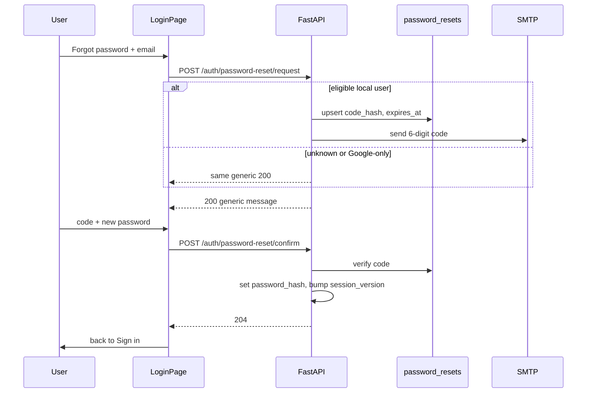

# Forgot password (immediate)

**Roadmap:** [product_roadmap_2026.md](product_roadmap_2026.md) — Immediate actions  
**Motivation:** Local accounts (admin bootstrap, `@smtpsender`, QA users) cannot recover a lost password without Fly secrets or DB edits. Google OIDC users keep using Google; this feature is for **email/password** recovery and for attaching a password to an existing local account.

**Reuse:** Registration verification already has 6-digit codes, HMAC hashing, SMTP, TTL, and attempt limits ([`email_verification.py`](../../backend/app/email_verification.py), [`email_send.py`](../../backend/app/email_send.py)). Mirror that pattern — do not invent a new email stack.

---

## Decisions (locked)

| Topic | Choice |
|-------|--------|
| Mechanism | **6-digit email code** (same UX as registration verify), then set new password |
| Who can reset | Users with a **password_hash** (local / bootstrap admin). Google-only accounts (no password) get a generic success on request and **no email**; confirm returns a clear error to use Google sign-in |
| Enumeration | Request endpoint always returns the **same 200 message** whether or not the email exists / is eligible |
| Session impact | On successful reset: update `password_hash`, **increment `session_version`** (invalidate other sessions), optionally establish a new session (v1: **redirect to login**, do not auto-login) |
| TTL / attempts | Reuse `email_verification_ttl_minutes` (15) and max **5** attempts; one active reset row per email |
| Rate limit | Per-email cooldown **60s** between request sends (in addition to attempt cap on confirm) |
| Token storage | New `password_resets` table (do not overload `email_verifications`, which stores pending registration password/name) |
| Migration | `011_password_resets` revising `010_game_ending_at` |

---

## Architecture



---

## Data model — migration `011_password_resets`

**File:** [`backend/alembic/versions/011_password_resets.py`](../../backend/alembic/versions/011_password_resets.py)

**Table `password_resets`**

| Column | Type | Notes |
|--------|------|-------|
| `id` | PK | |
| `email` | `String(255)` unique indexed | Normalized lower-case |
| `code_hash` | `String(64)` | HMAC-SHA256 like registration |
| `expires_at` | DateTime | |
| `attempts` | int default 0 | |
| `created_at` | DateTime | |
| `last_sent_at` | DateTime | For 60s resend cooldown |

**Model:** add `PasswordReset` in [`models.py`](../../backend/app/models.py).

---

## Backend

### Module [`backend/app/password_reset.py`](../../backend/app/password_reset.py)

- `_hash_code` / `_generate_code` — copy pattern from `email_verification` (or small shared helper later; v1 duplicate is OK)
- `request_password_reset(db, email) -> dict`
  - Validate email format
  - Look up `User` by email
  - If no user **or** `password_hash is None`: return generic message, **do not** write DB / send mail
  - If `last_sent_at` within 60s: return generic message (no new send) **or** 429 with “wait a moment” — prefer **generic 200** to avoid enumeration; skip send silently
  - Else: upsert row, send email via new `send_password_reset_email`
- `confirm_password_reset(db, email, code, new_password) -> None`
  - Validate email, code (6 digits), password policy
  - Load reset row; 400 if missing/expired/too many attempts
  - Constant-time compare hash; on fail increment attempts
  - Load user; 400 if missing or no longer has password capability
  - Set `user.password_hash = hash_password(new_password)`
  - `user.session_version += 1` (force re-login everywhere)
  - Delete reset row
  - Commit

### Email [`email_send.py`](../../backend/app/email_send.py)

```text
Subject: Your Scrabble Helper password reset code
Body: code + TTL + ignore if not requested
```

Honor `email_verification_dev_expose_code` for local/dev (expose `dev_code` in request response only when that flag is on).

### Routes [`main.py`](../../backend/app/main.py)

| Method | Path | Auth | Response |
|--------|------|------|----------|
| `POST` | `/auth/password-reset/request` | none | `200` `{ message, expires_in_minutes?, dev_code? }` |
| `POST` | `/auth/password-reset/confirm` | none | `204` |

Gate both on `settings.local_auth_enabled` (404 if disabled).

### Schemas

- `PasswordResetRequestIn`: `email`
- `PasswordResetConfirmIn`: `email`, `code`, `new_password`

---

## Frontend

### [`LoginPage.tsx`](../../frontend/src/pages/LoginPage.tsx)

Extend mode: `"login" | "register" | "forgot"`

**Forgot flow steps:**

1. **request** — email + “Send reset code” + link back to Sign in  
2. **confirm** — code + new password (+ confirm password field client-side) + “Reset password”

On success of confirm: set info “Password updated. Sign in with your new password.” and switch to `login`.

Link under password field on login: **Forgot password?**

### [`api.ts`](../../frontend/src/api.ts)

- `requestPasswordReset(email)`
- `confirmPasswordReset(email, code, newPassword)`

No new routes in `App.tsx` — stay on `/login`.

### Tests (Vitest)

- Renders Forgot password link when `local_auth_enabled`
- Request step shows generic success message after submit
- Confirm step calls API and returns to login mode on success

---

## Backend tests — [`test_password_reset.py`](../../backend/tests/test_password_reset.py)

Run with `DEV_AUTH_BYPASS=false` / local auth like `test_local_auth.py`.

| Case | Expect |
|------|--------|
| Unknown email request | 200, same message, no SMTP send (mock) |
| Google-only user (no `password_hash`) request | 200, no send |
| Local user request | 200, SMTP called once, row created |
| Confirm with valid code | 204, password verifies, `session_version` bumped, old sessions invalid |
| Confirm wrong code | 400, attempts++ |
| Confirm expired | 400 |
| Confirm after 5 failures | 400 locked until new request |
| Weak new password | 422/400 policy error |
| `local_auth_enabled=false` | 404 |

Mock `send_password_reset_email` in unit tests; optional integration with `email_verification_dev_expose_code`.

---

## PR strategy

Single PR preferred (small feature):

| Branch | Scope |
|--------|-------|
| `feat/forgot-password` | Migration + backend + tests + LoginPage + README |

**Commits (one per task):**

1. Migration `011_password_resets` + model  
2. `password_reset.py` + email helper + routes + schemas  
3. `test_password_reset.py`  
4. Frontend api + LoginPage flow  
5. Frontend Vitest  
6. README Basic users blurb  

---

## Acceptance criteria

- [ ] Local user can reset password via email code and sign in with the new password
- [ ] Request never reveals whether an email is registered
- [ ] Google-only accounts are not emailed a reset code
- [ ] Successful reset invalidates prior sessions (`session_version`)
- [ ] CI green; Alembic graph still single-head (`011` after `010`)
- [ ] README documents the flow

## Out of scope

- Magic links / JWT reset URLs  
- Changing Google account email  
- In-app “change password while logged in” (can follow later)  
- SMS  

## Ops note (until this ships)

Promote/reset admin still via Fly:

```bash
fly secrets set ADMIN_EMAIL="..." ADMIN_PASSWORD="..." -a scrabble-helper
```

After this feature: use **Forgot password** on `/login` for any local account that has SMTP delivery.

---

## Related

- [archive/local_auth_and_admin.md](archive/local_auth_and_admin.md) — original local auth  
- [fix_stale_live_game_recovery.md](fix_stale_live_game_recovery.md) — next immediate after this  
- [`email_verification.py`](../../backend/app/email_verification.py) — pattern to mirror  
