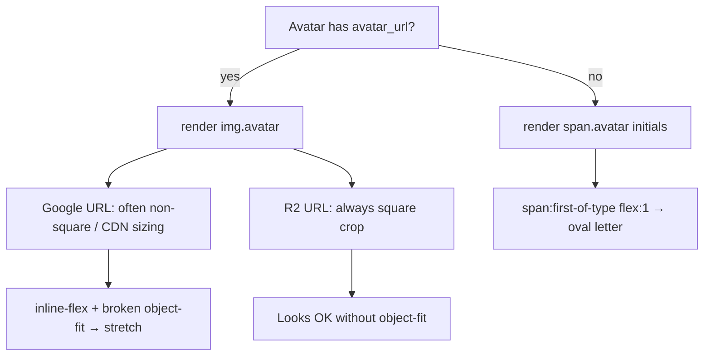
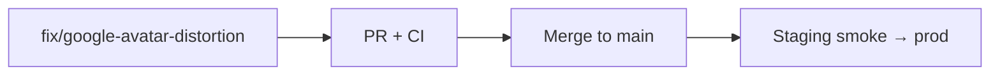

# Fix — Google avatar distortion on Find Friends

**Tracked in:** [README.md](../../README.md) Known Issues (2026-07-11)

**Surface:** Find Friends → **Your friends** (also Incoming requests / Search — same row CSS)

---

## Problem

Some Google OIDC friends show a stretched / oval profile photo in the friends list. Letter initials and custom R2 uploads look correct.

### Evidence (prod DOM)

| Friend | Markup | Photo source |
|--------|--------|--------------|
| Letter users (C/D/G) | `<span class="avatar avatar--sm">` | Initials fallback |
| Madison | `` | Custom upload (center-cropped square JPEG) |
| logan (@smtpsenderforlogan) | `` | `google_avatar_url` via [`resolve_avatar_url`](../../backend/app/storage.py) |

Only the Google CDN `` is reported distorted.

---

## Root cause

Two CSS bugs interact; the img path is what Google users hit.

### 1. Shared `.avatar` styles assume a letter `<span>`, not an ``

[`styles.css`](../../frontend/src/styles.css) — `.avatar`:

```css
.avatar {
  display: inline-flex;   /* letter layout */
  align-items: center;
  justify-content: center;
  border-radius: 50%;
  object-fit: cover;
  /* width/height from .avatar--sm etc. */
}
```

[`Avatar.tsx`](../../frontend/src/components/Avatar.tsx) puts the same classes on both `<span>` (initials) and `` (photo).

`display: inline-flex` on a replaced element (``) is undefined / inconsistent across browsers: **`object-fit: cover` may not crop the bitmap into the 2rem box**, so non-square or differently sized remote photos (Google `lh3` URLs) stretch to fill width/height. Custom R2 avatars are **forced square** in [`process_avatar`](../../backend/app/storage.py), so they often look fine even when `object-fit` is ignored — which matches “some Google users” only.

### 2. Friend row flex grow targets the wrong child when avatar is a `<span>`

```css
.friend-list__row > span:first-of-type {
  flex: 1;
}
```

| Avatar type | `:first-of-type` span | Effect |
|-------------|----------------------|--------|
| `` + name `<span>` | Name label | Correct (grow label) |
| Initials `<span.avatar>` + name `<span>` | **Avatar** | Avatar gets `flex: 1` → horizontal stretch (oval initials) |

Google photo users are not hit by (2), but initials friends are. Fix both in one PR so all friend-row avatars stay circular.



---

## Design decisions

| Topic | Decision |
|-------|----------|
| Scope | **Frontend CSS (+ light markup)** only. Do not proxy/re-host Google photos in v1 |
| Backend | No change to `google_avatar_url`, `resolve_avatar_url`, or avatar upload pipeline |
| Avatar API | Keep single `Avatar` component; branch styles by element (`img` vs `span`) |
| Other surfaces | Same `.avatar` / `Avatar` used on Settings + UserMenu — fix shared CSS so all stay circular |
| Persistence | Optional later: copy Google photo into R2 on first login (out of scope) |

---

## LLD — Implementation

### A. CSS — [`frontend/src/styles.css`](../../frontend/src/styles.css)

1. Keep `.avatar` as the **letter** base (`inline-flex`, background, color, font-weight).
2. Add **`img.avatar`** overrides:

```css
img.avatar {
  display: block;
  object-fit: cover;
  object-position: center;
  background: transparent; /* no accent circle behind photo */
}
```

3. Ensure size modifiers still apply (`width` / `height` / `border-radius` on both).

4. Replace fragile flex selector:

```css
/* before */
.friend-list__row > span:first-of-type { flex: 1; }

/* after */
.friend-list__row__label {
  flex: 1;
  min-width: 0; /* allow truncate if needed later */
}
```

### B. Markup — [`FindFriendsPage.tsx`](../../frontend/src/pages/FindFriendsPage.tsx)

Add `className="friend-list__row__label"` on the name `<span>` in:

- Incoming requests
- Search results
- Your friends

Do **not** put that class on action button wrappers.

### C. Component (optional hardening) — [`Avatar.tsx`](../../frontend/src/components/Avatar.tsx)

No prop changes required. Optional: add `decoding="async"` / `referrerPolicy="no-referrer"` on Google imgs if hotlink/referrer quirks appear in QA (not required for distortion fix).

### D. Tests

| Test | Assert |
|------|--------|
| `Avatar.test.tsx` | With `avatarUrl` → renders ``; without → `<span>` with initial |
| FindFriends (or CSS contract) | Friend row name span has `friend-list__row__label` |

Manual QA: Your friends list with (1) Google photo friend, (2) custom R2 friend, (3) initials friend — all circles, no oval stretch.

---

## PR strategy

Single small PR (CSS + label class + tests).

| PR | Branch (suggested) | Scope |
|----|-------------------|-------|
| **PR1** | `fix/google-avatar-distortion` | CSS img/span split, friend-row label flex, Vitest, README known-issue removal |



---

## Acceptance criteria

- [x] Google `lh3.googleusercontent.com` avatars render as **circles** (not stretched ovals) in Your friends
- [x] Custom R2 avatars unchanged / still circular
- [x] Initials avatars stay circular (not flexed wide)
- [x] Incoming + Search rows match Your friends
- [x] Settings + UserMenu avatars still correct
- [ ] CI green; Known Issues row N/A (issue never merged to main; fixed in same PR)

---

## Out of scope

- Caching / mirroring Google photos into R2
- Changing Google OIDC picture URL size params (`=s96-c`)
- New avatar crop UI

---

## Related

- [archive/friends_and_live_spectate.md](archive/friends_and_live_spectate.md) — friends UI
- [`Avatar.tsx`](../../frontend/src/components/Avatar.tsx)
- [`storage.resolve_avatar_url`](../../backend/app/storage.py) — prefers R2 key, else `google_avatar_url`
