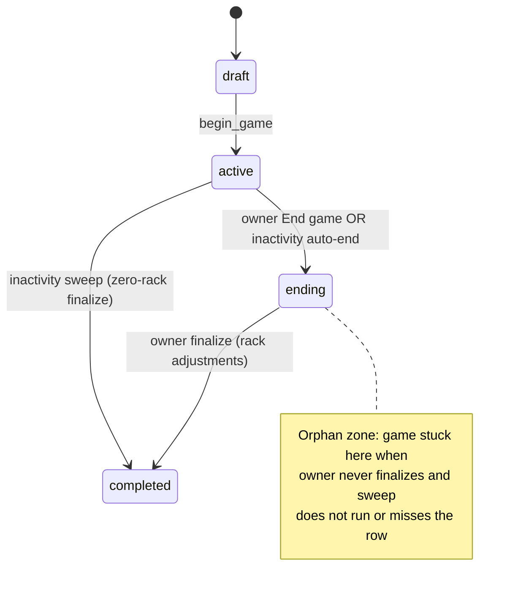
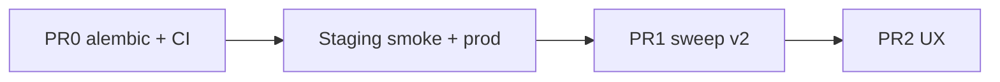

# Fix — Stale / orphan live game recovery

**Tracked in:** [README.md](../../README.md) Known Issues (2026-07-09)

**Prior work:** PR #21/#22 added `stale_live_games.py`, participant abandon, admin sweep — but **never reached production**. Deploy #22 failed staging smoke because PR #21 rewrote Alembic revision `009_user_session_version` → `009_game_ending_at`, crashing staging boot.

---

## Blocker — Deploy #22 / staging crash (fix first)

| Evidence | Detail |
|----------|--------|
| Workflow | [Deploy #22](https://github.com/haaslogan1/scrabble-helper/actions/runs/29057657727) failed at **Smoke staging** → prod never updated |
| Fly logs | Alembic starts → process **exit code 3** → max restart count 10 → machine **stopped** |
| Root cause | DB stamped at `009_user_session_version`; that revision file was deleted → `Can't locate revision identified by '009_user_session_version'` |
| Secondary | `009_game_ending_at.py` had a UTF-8 BOM |

**CI gap:** pytest uses `create_all` + `stamp head` and monkeypatches `run_migrations` ([`conftest.py`](../../backend/tests/conftest.py)). Broken revision chains do not fail CI today.

---

## Problem (production — after deploy unblocked)

| Actor | Symptom |
|-------|---------|
| **Owner** (@haaslogan1) | Cannot add @madisonmitchellusa to a new live game (`participant_busy`). Home shows no in-progress game. |
| **Participant** (@madisonmitchellusa) | Notification for a ~4-day-old live game → `/game/:id/play` → redirected to **End game** → **Finalize** → `403 Only the game owner can do this`. Still blocked from new games. |

---

## Root cause analysis (product bug)



### 1. `ending` is treated as "in live game" for blocking

[`friends.user_in_active_live_game`](../../backend/app/friends.py) queries `status IN (active, ending)`. An orphan `ending` game still blocks [`validate_linked_players_for_live`](../../backend/app/friends.py) with `participant_busy`.

### 2. Spectator routed to owner-only finalize UI

[`GamePlayPage.tsx`](../../frontend/src/pages/GamePlayPage.tsx) redirects **all** roles when `status === "ending"` to `/end`. [`finalize_game`](../../backend/app/services.py) is owner-only → 403 for spectators.

### 3. Owner has no home visibility

[`list_participating_games`](../../backend/app/stale_live_games.py) excludes the owner. Home banner never shows owner-owned live games.

### 4. Sweep gaps

On-demand only; null `last_activity_at` skipped; fresh `ending_at` can reset the idle clock.

---

## Design decisions

| Topic | Decision |
|-------|----------|
| Alembic chain | **Never delete/replace a shipped revision id.** Restore `009_user_session_version`; add `010_game_ending_at` |
| CI migrations | Graph integrity + upgrade-from-prior-stamp tests in pytest (every PR) |
| Who can finalize with rack adjustments | **Owner only** (unchanged) |
| Stale `ending` games (≥ 3h idle) | **Auto zero-rack finalize** on any read/sweep |
| Participant recovery | **Abandon** when idle ≥ threshold; never show finalize form |
| Owner home UX | **"Your live games"** banner with Resume + Abandon |
| `last_activity_at` fallback | `started_at`, then `created_at` |

---

## PR strategy

Merge order: **PR0 → PR1 → PR2**. PR0 unblocks staging/prod deploy of the already-merged stale-live code.

| PR | Branch (suggested) | Scope |
|----|-------------------|-------|
| **PR0** | `fix/alembic-revision-chain-ci` | Restore migration chain + Alembic CI tests + plan/docs |
| **PR1** | `fix/stale-live-sweep-v2` | Backend sweep hardening, participant ending recovery, cron hook |
| **PR2** | `fix/stale-live-ux` | Owner home banner, routing guards, notification link resolver |



---

## PR0 — Alembic revision repair + CI guards (blocking)

### Migration fix

1. Restore [`backend/alembic/versions/009_user_session_version.py`](../../backend/alembic/versions/009_user_session_version.py) (idempotent column adds)
2. Replace `009_game_ending_at` with [`010_game_ending_at.py`](../../backend/alembic/versions/010_game_ending_at.py) — `down_revision = "009_user_session_version"`, **no UTF-8 BOM**
3. Delete `009_game_ending_at.py`
4. Optional stamp alias in [`main.py`](../../backend/app/main.py): `009_game_ending_at` → `009_user_session_version` (if any DB was stamped at the orphaned id)

After deploy, staging/prod stamped at `009_user_session_version` can `upgrade` → `010_game_ending_at` and boot.

### Alembic CI tests — [`backend/tests/test_alembic.py`](../../backend/tests/test_alembic.py)

| Test | What it catches |
|------|-----------------|
| Single head; every `down_revision` resolves | Broken / forked history |
| No UTF-8 BOM on version files | Silent load/parse footguns |
| `009_user_session_version` present; head is `010_game_ending_at` | Accidental deletion of shipped revision |
| Upgrade path from `009_user_session_version` → `head` | Exact deploy #22 failure mode |
| Isolated SQLite: `create_all` → stamp `009_user_session_version` → `upgrade head` succeeds | Boot-path regression |

These run in the existing CI `pytest` job (Postgres service unchanged; upgrade regression uses temp SQLite so it does not fight `conftest` `create_all`).

### Acceptance (PR0)

- [ ] Staging boots; `/health` and `/health?db=1` return 200
- [ ] Deploy workflow passes staging smoke and promotes to prod
- [ ] `pytest tests/test_alembic.py` green in CI

---

## PR1 — Backend sweep hardening

### Files

- [`backend/app/stale_live_games.py`](../../backend/app/stale_live_games.py) — `activity_anchor(game)`; null-`last_activity_at` rows; long-lived `ending` stale by `started_at`
- [`backend/app/friends.py`](../../backend/app/friends.py) — sweep before `participant_busy`
- [`backend/app/main.py`](../../backend/app/main.py) — optional `POST /api/internal/sweep-stale` for cron
- [`backend/tests/test_stale_live_games.py`](../../backend/tests/test_stale_live_games.py)

### `activity_anchor(game)`

```python
def activity_anchor(game: Game) -> datetime | None:
    if game.status == GameStatus.ending and game.ending_at:
        return game.ending_at
    return game.last_activity_at or game.started_at or game.created_at
```

### Tests (ship gate)

1. Active game, `last_activity_at = NULL`, `started_at` 4d ago → swept to `completed`
2. `ending` game, fresh `ending_at` but old `started_at` → swept to `completed`
3. Participant abandon on stale `ending` → `completed`
4. After sweep, new live game with same friend succeeds

---

## PR2 — Frontend routing and owner visibility

### Files

- [`HomePage.tsx`](../../frontend/src/pages/HomePage.tsx) — owner "Your live games" banner
- [`GamePlayPage.tsx`](../../frontend/src/pages/GamePlayPage.tsx) — spectators in `ending`: waiting + Abandon (not `/end`)
- [`GameEndPage.tsx`](../../frontend/src/pages/GameEndPage.tsx) — owner-only finalize
- [`NotificationBell.tsx`](../../frontend/src/components/NotificationBell.tsx) — resolve links by current game status

### Frontend tests

- Spectator/`ending` notification must not route to `/end`
- `GameEndPage` non-owner does not render finalize

---

## Acceptance criteria (full feature)

- [ ] PR0 merged; staging healthy; prod has stale-live code from PR #21
- [ ] @madisonmitchellusa not blocked; @haaslogan1 can start a new live game with her
- [ ] Old live-game notification never lands on owner-only Finalize 403
- [ ] Owner sees in-progress live game on home
- [ ] Games idle ≥ 3h auto-complete
- [ ] README Known Issues row removed after final ship

---

## Immediate mitigation (ops)

Until sweep/UX PRs ship, admin can unblock users on **prod** (still on pre-PR21 image until PR0 deploys):

```powershell
curl https://scrabble-helper.fly.dev/api/admin/games?owner_email=haaslogan1@gmail.com -b cookies.txt
curl -X POST https://scrabble-helper.fly.dev/api/admin/games/{id}/force-complete -b cookies.txt
curl -X POST https://scrabble-helper.fly.dev/api/admin/games/sweep-stale -b cookies.txt
```

After PR0: staging should recover automatically on deploy; confirm with `fly logs -a scrabble-helper-staging`.

---

## Related docs

- [archive/friends_and_live_spectate.md](archive/friends_and_live_spectate.md) — single active live game rule
- [archive/notification_bell_system.md](archive/notification_bell_system.md) — notification types and links
- [phase1_quick_wins_prs.md](phase1_quick_wins_prs.md) — original inactivity timeout
- [RELEASE.md](../RELEASE.md) — staging smoke gates prod
