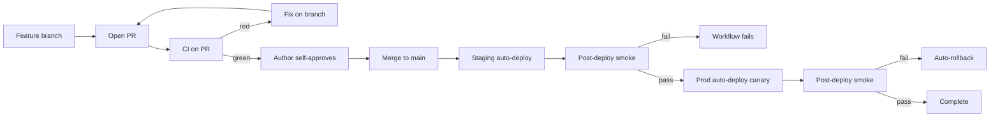
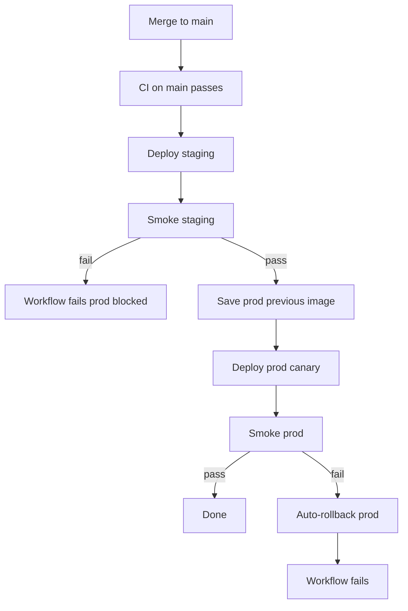

# Phase 0 — Foundation: Low-Level Implementation Plan

**Roadmap context:** [Product Roadmap 2026](product_roadmap_2026_36ec752e.plan.md) → Phase 0

**Priorities covered:** #9 Release procedure, #10 UI overhaul

---

## Acceptance criteria (phase complete when)

- [ ] All work lands via **feature branch → PR → CI green → merge to `main`** (no direct commits to `main`)
- [ ] PR author can self-approve and merge (solo-repo policy documented)
- [ ] `scrabble-helper-staging.fly.dev` deploys automatically on merge to `main` (after CI)
- [ ] **Staging deploy workflow fails if post-deploy smoke fails**
- [ ] **Prod deploy runs automatically after staging smoke passes** (no manual prod approval until Phase 6 go-live)
- [ ] **Prod post-deploy smoke runs automatically; failure triggers auto-rollback to previous release**
- [ ] `fly deploy --strategy canary` on prod
- [ ] `/health?db=1` returns 503 when DB unreachable; Fly HTTP checks use this path
- [ ] User has picked UI direction (A/B/C) and all 12 pages match new design system
- [ ] Light/dark theme still works
- [ ] No regressions in existing pytest suite + frontend build

---

## Delivery + deploy pipeline

All feature work uses **PRs**. Merge to `main` triggers deploy. **Prod is automatic** after staging smoke (manual prod gate deferred to Phase 6 SEO/marketing go-live).



### PR workflow (every commit group)

1. Branch: `phase0/health-check`, `phase1/feedback`, etc.
2. Commit(s) on branch — one focused commit per task where possible
3. Push branch
4. `gh pr create` targeting `main`
5. Wait for **CI on PR** ([`.github/workflows/ci.yml`](../../dev/scrabble-helper/.github/workflows/ci.yml))
6. Author **self-approves** (`gh pr review --approve`) and **merges** (`gh pr merge`) when green
7. Merge to `main` triggers deploy workflow (below)

**GitHub repo settings (manual, one-time):**
- Branch protection on `main`: require status check `test` (CI job name)
- **Allow PR author to approve their own PR** (disable "require approval from someone other than the last pusher" / do not require separate reviewer for solo repo)
- Do **not** add `production` Environment approval gate yet (added in Phase 6)

---

## Post-deploy + rollback architecture (Tier 1)

Tier 1 = **Fly health checks** + **automated smoke after each deploy** + **rollback on prod smoke failure**. Prod promote is **automatic** once staging smoke passes (pre-go-live policy).



**Deferred to Phase 6 go-live:** manual prod approval via GitHub Environment; push-window enforcement on prod promote.

**What Tier 1 does not cover (deferred):** gradual traffic ramp, exception-rate metrics, Sentry alerting, 30-minute post-deploy polling. See **Out of scope** below.

---

## Track A — Release pipeline

### Commit 1: Staging Fly app config

**New file:** [`fly.staging.toml`](../../dev/scrabble-helper/fly.staging.toml)

```toml
app = "scrabble-helper-staging"
primary_region = "iad"

[env]
  BASE_URL = "https://scrabble-helper-staging.fly.dev"
  FRONTEND_URL = "https://scrabble-helper-staging.fly.dev"
  COOKIE_SECURE = "true"
  DEV_AUTH_BYPASS = "false"
  # DATABASE_URL set via fly secrets (separate Neon DB)

[http_service]
  internal_port = 8080
  force_https = true
  auto_stop_machines = "stop"
  auto_start_machines = true
  min_machines_running = 0

[[vm]]
  memory = "512mb"
  cpu_kind = "shared"
  cpus = 1
```

**Manual ops (document in RELEASE.md, not automated):**

```powershell
fly apps create scrabble-helper-staging
fly secrets set DATABASE_URL="..." SESSION_SECRET="..." ... --app scrabble-helper-staging
fly deploy --config fly.staging.toml --app scrabble-helper-staging
```

**Do not** commit secrets. Staging uses its own Postgres instance (Neon free tier).

---

### Commit 2: Health check with DB gate

**File:** [`backend/app/main.py`](../../dev/scrabble-helper/backend/app/main.py)

Replace `/health`:

```python
@app.get("/health")
def health(db: bool = Query(False)) -> dict[str, str]:
    if not db:
        return {"status": "ok"}
    try:
        db_session = SessionLocal()
        db_session.execute(text("SELECT 1"))
        db_session.close()
        return {"status": "ok", "db": "ok"}
    except Exception:
        raise HTTPException(status_code=503, detail="Database unavailable")
```

**File:** [`fly.toml`](../../dev/scrabble-helper/fly.toml) — add under `[http_service]`:

```toml
  [[http_service.checks]]
    grace_period = "10s"
    interval = "30s"
    method = "GET"
    path = "/health?db=1"
    timeout = "5s"
```

Mirror in `fly.staging.toml`.

**Test:** [`backend/tests/test_auth.py`](../../dev/scrabble-helper/backend/tests/test_auth.py) — add case for `/health?db=1`.

---

### Commit 3: Deploy workflow (staging → prod chain)

**New file:** [`.github/workflows/deploy.yml`](../../dev/scrabble-helper/.github/workflows/deploy.yml)

Triggered only after **CI succeeds on push to `main`** (i.e. after PR merge):

```yaml
name: deploy

on:
  workflow_run:
    workflows: [ci]
    types: [completed]
    branches: [main, master]

jobs:
  deploy:
    if: github.event.workflow_run.conclusion == 'success' && github.event.workflow_run.event == 'push'
    runs-on: ubuntu-latest
    steps:
      - uses: actions/checkout@v4
      - uses: superfly/flyctl-actions/setup-flyctl@master

      # --- Staging ---
      - name: Deploy staging
        run: flyctl deploy --config fly.staging.toml --remote-only
        env:
          FLY_API_TOKEN: ${{ secrets.FLY_API_TOKEN }}

      - name: Smoke staging
        working-directory: backend
        run: pip install httpx && python scripts/smoke_test.py --retries 12
        env:
          BASE_URL: https://scrabble-helper-staging.fly.dev

      # --- Production (automatic after staging smoke) ---
      - name: Save previous prod release image
        id: prev
        run: |
          IMAGE=$(flyctl releases list -a scrabble-helper -j | jq -r '.[0].ImageRef')
          echo "image=$IMAGE" >> "$GITHUB_OUTPUT"

      - name: Deploy production canary
        run: flyctl deploy --strategy canary --remote-only
        env:
          FLY_API_TOKEN: ${{ secrets.FLY_API_TOKEN }}

      - name: Smoke production
        id: smoke_prod
        working-directory: backend
        run: pip install httpx && python scripts/smoke_test.py --retries 12
        env:
          BASE_URL: https://scrabble-helper.fly.dev

      - name: Rollback prod on smoke failure
        if: failure() && steps.smoke_prod.outcome == 'failure'
        run: flyctl deploy --image "${{ steps.prev.outputs.image }}" -a scrabble-helper --strategy immediate
        env:
          FLY_API_TOKEN: ${{ secrets.FLY_API_TOKEN }}
```

**Optional `workflow_dispatch`** with `target: staging-only` for redeploy drills — prod never manual in this phase.

**GitHub setup (manual):**
1. Repo secret `FLY_API_TOKEN` (from `fly tokens create deploy`)
2. Branch protection on `main` — require CI status check before merge
3. Allow author self-approval on PRs
4. **No** `production` Environment gate until Phase 6

**Prod scale for canary:** Temporarily set `min_machines_running = 2` in prod `fly.toml` for true canary, or accept single-machine rolling update.

---

### Commit 4: Post-deploy smoke + Tier 1 auto-rollback

#### 4a — Extend smoke script

**File:** [`backend/scripts/smoke_test.py`](../../dev/scrabble-helper/backend/scripts/smoke_test.py)

Add checks (in order):

1. `GET /health` → 200
2. `GET /health?db=1` → 200 with `"db": "ok"`
3. `GET /` → 200 (SPA shell)
4. Optional `--deep` flag (staging only, when secrets present):
   - `POST /auth/login` with `SMOKE_EMAIL` / `SMOKE_PASSWORD`
   - `GET /api/me` → 200
   - `GET /api/home` → 200

CLI:

```python
parser.add_argument("--deep", action="store_true", help="Login + authenticated API checks")
parser.add_argument("--retries", type=int, default=12, help="Retries while machine starts")
parser.add_argument("--retry-delay", type=float, default=10.0)
```

Retry loop: Fly cold-start can take 30–60s after deploy; poll until success or timeout (~2 min).

#### 4b — Post-deploy smoke (integrated in Commit 3)

Smoke steps live in the single `deploy` job above (staging smoke gates prod). Commit 4 focuses on extending [`smoke_test.py`](../../dev/scrabble-helper/backend/scripts/smoke_test.py) only.

**Staging smoke failure:** job stops — **prod is never deployed**.

**Production job steps** (same job, after staging smoke):

```yaml
- name: Save previous release image
  id: prev
  run: |
    IMAGE=$(flyctl releases list -a scrabble-helper -j | jq -r '.[0].ImageRef')
    echo "image=$IMAGE" >> "$GITHUB_OUTPUT"

- name: Deploy production canary
  run: flyctl deploy --strategy canary --remote-only
  env:
    FLY_API_TOKEN: ${{ secrets.FLY_API_TOKEN }}

- name: Post-deploy smoke
  id: smoke
  working-directory: backend
  run: pip install httpx && python scripts/smoke_test.py --retries 12
  env:
    BASE_URL: https://scrabble-helper.fly.dev

- name: Rollback on smoke failure
  if: failure() && steps.smoke.outcome == 'failure'
  run: |
    echo "Smoke failed — rolling back to ${{ steps.prev.outputs.image }}"
    flyctl deploy --image "${{ steps.prev.outputs.image }}" -a scrabble-helper --strategy immediate
  env:
    FLY_API_TOKEN: ${{ secrets.FLY_API_TOKEN }}

- name: Fail workflow after rollback
  if: failure() && steps.smoke.outcome == 'failure'
  run: exit 1
```

**GitHub secrets (optional for deep staging smoke):**
- `STAGING_SMOKE_EMAIL` / `STAGING_SMOKE_PASSWORD` — dedicated staging-only basic user (create via register on staging once)

**Cost:** $0 beyond existing GitHub Actions free tier (~2–5 min per deploy).

#### 4c — Smoke test in CI (local regression)

**File:** [`.github/workflows/ci.yml`](../../dev/scrabble-helper/.github/workflows/ci.yml) — optional step after pytest:

Run `smoke_test.py` against a started uvicorn in the same job (validates script itself). Not required for first ship but prevents script drift.

---

### Commit 5: Release + PR documentation

**New file:** [`docs/RELEASE.md`](../../dev/scrabble-helper/docs/RELEASE.md)

Sections:
- **PR workflow:** feature branch → PR → CI → self-approve → merge (solo repo)
- **Deploy flow:** merge to `main` → CI → staging deploy → staging smoke → **auto prod** → prod smoke → rollback on prod smoke fail
- **No manual prod gate** until Phase 6 go-live (document when it will return)
- Auto-rollback on prod smoke failure
- Manual rollback command: `fly deploy --image <previous-image>`
- Optional manual QA checklist (login, game flow) — supplement to smoke, not a deploy gate
- Secrets inventory: `FLY_API_TOKEN`, optional `STAGING_SMOKE_*`
- Push window: applies to **git push** of branches; deploy workflow runs on merge (any time)
- Tier 1 limitations

**Update:** [`README.md`](../../dev/scrabble-helper/README.md) — link RELEASE.md; note PR-required workflow

---

## Track B — UI overhaul (blocked until user picks A/B/C)

### Commit 6: Design tokens

**File:** [`frontend/src/styles.css`](../../dev/scrabble-helper/frontend/src/styles.css)

Add token layer under `:root`:

| Token | Option A | Option B | Option C |
|-------|----------|----------|----------|
| `--font-display` | Fraunces | system + rounded | DM Sans |
| `--font-body` | system-ui | system-ui | DM Sans |
| `--radius-card` | 6px | 14px | 4px |
| `--card-gradient` | none/subtle | keep warm | flat `#fff` |

Load Google Font in [`frontend/index.html`](../../dev/scrabble-helper/frontend/index.html) if needed.

**File:** [`frontend/src/theme/ThemeContext.tsx`](../../dev/scrabble-helper/frontend/src/theme/ThemeContext.tsx) — no logic change; verify dark tokens updated.

---

### Commit 7: Extract shared components

**New files:**

```
frontend/src/components/ui/
  Button.tsx      # variant: primary | secondary | ghost
  Card.tsx        # wraps .card patterns
  PageTitle.tsx   # h1.page-title consistency
  Tag.tsx         # .tag, .tag--ok, .tag--warn
```

Refactor one page first (HomePage) as template; keep class names in CSS for minimal churn.

---

### Commit 8: Page-by-page UI pass

**Order (highest visibility first):**

| File | Changes |
|------|---------|
| [`HomePage.tsx`](../../dev/scrabble-helper/frontend/src/pages/HomePage.tsx) | Warmer copy, tile icons optional |
| [`GamePlayPage.tsx`](../../dev/scrabble-helper/frontend/src/pages/GamePlayPage.tsx) | Timer prominence, button hierarchy |
| [`LoginPage.tsx`](../../dev/scrabble-helper/frontend/src/pages/LoginPage.tsx) | AuthLayout polish |
| [`SiteHeader.tsx`](../../dev/scrabble-helper/frontend/src/components/SiteHeader.tsx) | Brand typography |
| Remaining pages | Apply Card/Button; copy pass |

**Copy guidelines:** Replace "End-to-end Scrabble scorekeeping and analytics" with conversational lines ("Track tonight's game", "See who wins the family rivalry").

**Do not** change routes in this phase.

---

## Verification checklist

```powershell
# Local
cd backend && pytest
cd frontend && npm run build

# Smoke script (local or against staging)
$env:BASE_URL="https://scrabble-helper-staging.fly.dev"
python backend/scripts/smoke_test.py

# Deep smoke (optional, staging credentials)
$env:SMOKE_EMAIL="..."; $env:SMOKE_PASSWORD="..."
python backend/scripts/smoke_test.py --deep
```

**Deploy pipeline tests (manual once):**
1. Introduce intentional `/health?db=1` failure on staging → confirm workflow fails
2. Prod deploy with passing smoke → success
3. (Optional drill) Break prod smoke in a test deploy → confirm auto-rollback runs

Manual: light/dark toggle, full game flow draft→play→end→detail.

---

## Out of scope

- Public landing page (Phase 6)
- Feedback widget (Phase 1)
- Route changes (`/` stays dashboard until Phase 6)
- **Manual prod approval** — re-added in [Phase 6 Growth](phase6_growth_impl.plan.md) at SEO/marketing go-live
- **Tier 2+ reliability:** Sentry alerting, 30-minute post-deploy polling, gameplay QA against live URL, feature flags, true error-rate / SLO-based rollback
