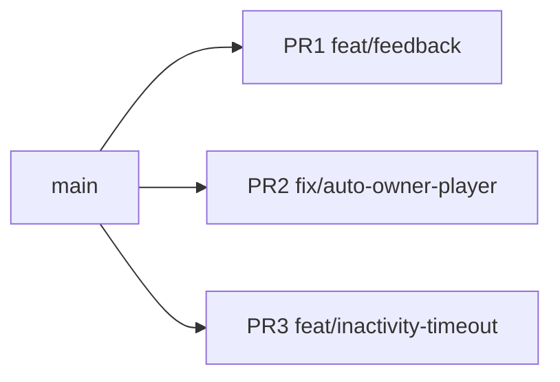
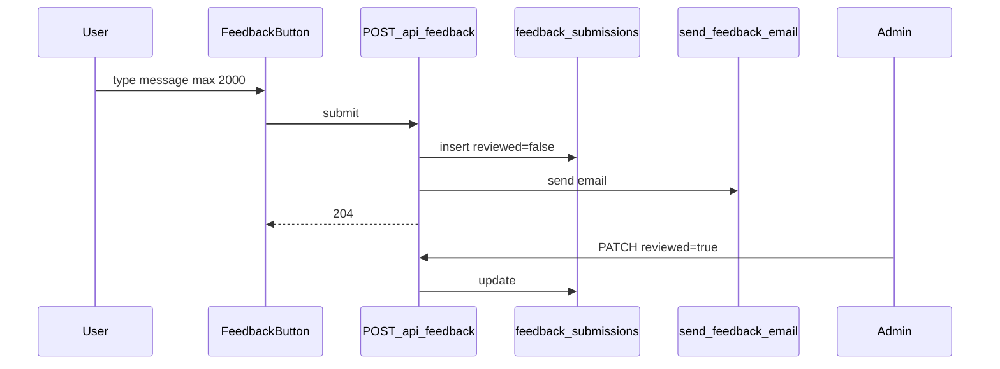
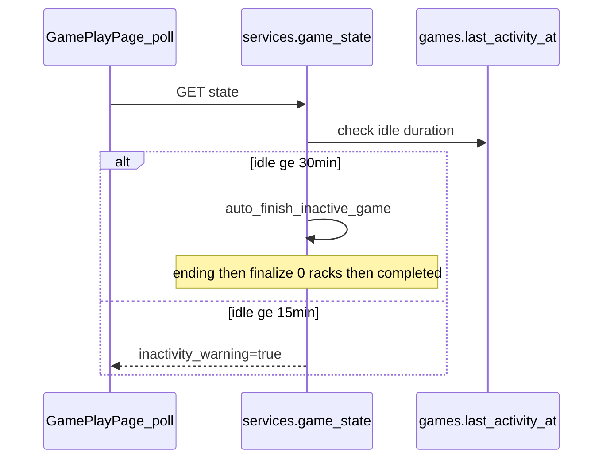

# Phase 1 — Quick Wins (3 PRs)

**Base plan:** [phase1_quick_wins_impl.plan.md](c:\Users\haasl\.cursor\plans\phase1_quick_wins_impl.plan.md)

**Current state:** Feedback and inactivity features do not exist yet. Owner is set on `POST /api/games` but not auto-added as a `GamePlayer`. No frontend test runner exists ([`frontend/package.json`](frontend/package.json) — build only).

---

## PR strategy

Three **independent PRs** off `main`. No stacking required — each can merge in any order. Recommended merge order: **PR1 → PR2 → PR3** (feedback first; owner and inactivity are unrelated to each other).

| PR | Branch (suggested) | Scope | Migration |
|----|--------------------|-------|-----------|
| **PR1** | `feat/feedback` | Feedback widget, admin review, backend + frontend tests | `005_feedback.py` |
| **PR2** | `fix/auto-owner-player` | Auto-include game owner in roster + player picker UX | none |
| **PR3** | `feat/inactivity-timeout` | 15m warning, 30m auto-finish, play-page modal | `006_game_last_activity.py` |

Each PR includes its own tests and README cleanup for the known issue it resolves. Vitest bootstrap lives in **PR1 only** (first frontend test infra).



---

## Acceptance criteria (by PR)

### PR1 — Feedback
- Authenticated user submits feedback → **204**, row persisted with `reviewed=false`, email send attempted (mocked in tests)
- Admin lists unreviewed feedback and marks `reviewed=true`
- Textarea shows `N/2000`; input hard-stops at 2000 chars
- Backend + frontend tests pass; CI runs `npm test`

### PR2 — Auto-owner player
- Owner always in roster when setting players; only opponents selectable in UI
- `test_owner_player.py` proves owner injected when only opponent IDs submitted
- README owner-selection known issue removed

### PR3 — Inactivity
- Active game idle **15 min** → warning modal
- Idle **30 min** → auto `ending` + finalize with **0 rack adjustments** → `completed`
- `test_inactivity.py` covers warn, ack, auto-finish
- README inactivity known issue removed

---

## PR1 — Feedback (`feat/feedback`)

### Architecture



### Commits (one per task)

1. **Feedback backend** — migration `005_feedback.py`, model, config, `send_feedback_email`, `POST /api/feedback`, admin `GET/PATCH /api/admin/feedback`
2. **`test_feedback.py`** — auth, 204 + email mock, rate limit, 422 on 2001 chars, submit → admin resolve
3. **Feedback frontend** — `submitFeedback` in [`frontend/src/api.ts`](frontend/src/api.ts), [`FeedbackButton.tsx`](frontend/src/components/FeedbackButton.tsx), styles, mount in [`App.tsx`](frontend/src/App.tsx)
4. **Frontend tests + CI** — vitest setup, `FeedbackButton.test.tsx`, CI `npm test` step in [`.github/workflows/ci.yml`](.github/workflows/ci.yml)

### Key files

| Area | Files |
|------|-------|
| Migration | `backend/alembic/versions/005_feedback.py` |
| Backend | [`models.py`](backend/app/models.py), [`config.py`](backend/app/config.py), [`email_send.py`](backend/app/email_send.py), [`schemas.py`](backend/app/schemas.py), [`main.py`](backend/app/main.py), [`admin.py`](backend/app/admin.py) |
| Tests | [`backend/tests/test_feedback.py`](backend/tests/test_feedback.py) |
| Frontend | [`FeedbackButton.tsx`](frontend/src/components/FeedbackButton.tsx), [`FeedbackButton.test.tsx`](frontend/src/components/FeedbackButton.test.tsx), [`vitest.config.ts`](frontend/vitest.config.ts) |

### Feedback table

| Column | Type | Notes |
|--------|------|-------|
| id | int PK | |
| user_id | int FK users | |
| category | varchar(50) nullable | bug, idea, other |
| message | text | max 2000 |
| page_url | varchar(512) nullable | |
| game_id | int nullable | |
| reviewed | boolean | default false, not null |
| created_at | datetime | index with user_id for rate limit |

### Char limit UX (frontend)
- `maxLength={2000}`, `onChange` slice to 2000, counter `{message.length}/2000`
- Submit disabled when empty

---

## PR2 — Auto-owner player (`fix/auto-owner-player`)

### Commits

1. **Backend** — `ensure_owner_player()` + inject in `set_game_players()` in [`services.py`](backend/app/services.py); optional `is_self` on `GET /api/players`
2. **Frontend** — [`GamePlayersPage.tsx`](frontend/src/pages/GamePlayersPage.tsx): read-only "You — always playing" row, opponent-only checkboxes, continue when ≥1 opponent
3. **Tests + README** — [`test_owner_player.py`](backend/tests/test_owner_player.py); remove owner-selection row from [`README.md`](README.md) Known Issues

### Backend logic

```python
def ensure_owner_player(db, user) -> Player:
    # find or create Player(owner_user_id=user.id, linked_user_id=user.id)

def set_game_players(...):
    owner_player = ensure_owner_player(db, user)
    if owner_player.id not in player_ids:
        player_ids = [owner_player.id] + [p for p in player_ids if p != owner_player.id]
```

### Tests (`auth_client`)

1. Create opponent "Bob" only
2. Create game, `PUT players` with `[bob_id]` only
3. Assert roster includes owner-linked player
4. `POST begin` succeeds with owner in active roster
5. Second game reuses same owner player record

---

## PR3 — Inactivity timeout (`feat/inactivity-timeout`)

### Architecture



### Commits

1. **Backend** — migration `006_game_last_activity.py`, constants, `last_activity_at` updates, `auto_finish_inactive_game()`, `inactivity_warning` in state, `POST ack-inactivity`
2. **Frontend** — warning modal in [`GamePlayPage.tsx`](frontend/src/pages/GamePlayPage.tsx)
3. **Tests + README** — [`test_inactivity.py`](backend/tests/test_inactivity.py); remove inactivity row from [`README.md`](README.md) Known Issues

### Constants

```python
INACTIVITY_WARN_AFTER_SEC = 15 * 60   # 900
INACTIVITY_END_AFTER_SEC = 30 * 60    # 1800
```

### Auto-finish at 30 min

When idle ≥ 30 min and `status == active`: set `ending` → finalize all players with `rack_adjustment=0` → `completed` → `notify_game_completed`. Triggered from `game_state` builder (poll/WS).

### Modal copy

"No turns recorded in 15 minutes. Continue playing or end the game?"

### Tests

| Test | Assert |
|------|--------|
| 16 min idle | `inactivity_warning: true` |
| 10 min idle | `inactivity_warning: false` |
| ack-inactivity | warning clears |
| 31 min idle | `status == completed`, all racks 0 |

---

## Out of scope (all PRs)

- Privacy page
- Single-session enforcement (separate known issue)
- Real SMTP inbox verification in CI

---

## Execution checklist (when approved)

For each PR:
1. Branch from `main`
2. Implement commits in order (one small commit per task)
3. Push and open PR with scoped summary + test plan
4. Merge independently; no cross-PR dependencies
