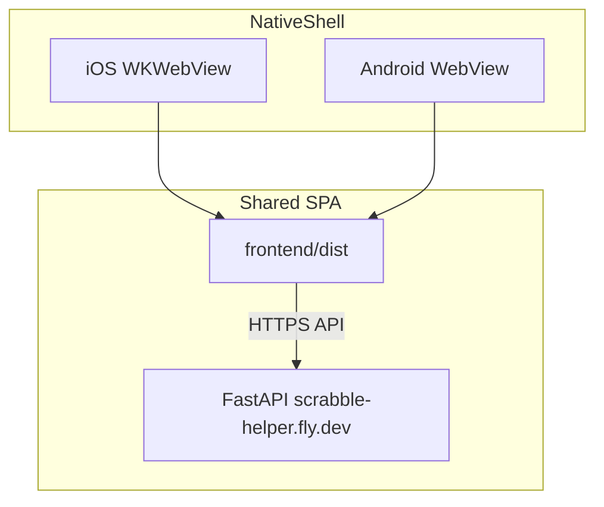

# Phase 4 — Mobile Apps: Low-Level Implementation Plan

**Roadmap context:** [Product Roadmap 2026](product_roadmap_2026_36ec752e.plan.md) → Phase 4

**Priority covered:** #3 Mobile (iOS + Android)

**Depends on:** [Phase 3](phase3_photos_impl.plan.md)

---

## Acceptance criteria

- [ ] iOS (TestFlight) and Android (internal track) build from same `frontend/` codebase
- [ ] Login (Google OAuth + email/password) works in app
- [ ] Full game flow works: create → play → end → detail with photos
- [ ] On native iOS/Android, owner can upload a photo by taking a new picture **or** selecting one from the device photo library
- [ ] Deep link `scrabblehelper://game/{id}/play` opens correct screen
- [ ] No AdMob / ads in this phase
- [ ] App rejected risks documented (OAuth redirect, privacy URL)

---

## Architecture



**Decision:** Capacitor 6.x at repo root or inside `frontend/`. Recommended: **`frontend/` as Capacitor app root** (where `dist/` lives).

---

## Commit 1: Capacitor bootstrap

### Install (in `frontend/`)

```powershell
npm install @capacitor/core @capacitor/cli @capacitor/ios @capacitor/android
npx cap init "Scrabble Helper" "com.scrabblehelper.app" --web-dir dist
```

### Config

**New:** `frontend/capacitor.config.ts`

```typescript
import type { CapacitorConfig } from "@capacitor/cli";

const config: CapacitorConfig = {
  appId: "com.scrabblehelper.app",
  appName: "Scrabble Helper",
  webDir: "dist",
  server: {
    // Production: omit url, load bundled dist
    // Dev only: url: "http://10.0.2.2:5173" android emulator
  },
};
export default config;
```

### API base URL

**File:** [`frontend/src/api.ts`](../../dev/scrabble-helper/frontend/src/api.ts)

Today uses relative `/api/...` (works when SPA served from same origin as API). In Capacitor bundled mode, origin is `capacitor://localhost` — **must use absolute API URL**:

```typescript
const API_BASE =
  import.meta.env.VITE_API_BASE_URL ??
  (import.meta.env.DEV ? "" : window.location.origin);

async function apiFetch(path: string, init?: RequestInit) {
  const url = path.startsWith("http") ? path : `${API_BASE}${path}`;
  ...
}
```

**Docker/Fly build:** Set `VITE_API_BASE_URL=https://scrabble-helper.fly.dev` at frontend build time for mobile builds only, OR use same-origin if you ship API+SPA together (current Docker — mobile loads remote URL instead of bundle).

**Recommended mobile approach:** Load production URL in WebView instead of bundled static files:

```typescript
server: { url: "https://scrabble-helper.fly.dev", cleartext: false }
```

Pros: always latest web deploy, no app store update for UI fixes. Cons: requires network, not offline. Document choice in README.

**Alternative:** Bundle dist + `VITE_API_BASE_URL` — true offline shell, store updates for UI.

### npm scripts

**File:** [`frontend/package.json`](../../dev/scrabble-helper/frontend/package.json):

```json
"cap:sync": "npm run build && npx cap sync",
"cap:ios": "npm run cap:sync && npx cap open ios",
"cap:android": "npm run cap:sync && npx cap open android"
```

### Gitignore

Add `frontend/ios/` and `frontend/android/` OR commit them (team preference). Capacitor docs recommend committing native projects.

---

## Commit 2: Auth + deep links

### Google OAuth in WebView

Google blocks OAuth in embedded WebViews on some platforms. **Mitigation options:**

| Option | Implementation |
|--------|----------------|
| **A (recommended)** | `@capacitor/browser` — open system browser for `/auth/login/google`, callback to app custom scheme |
| B | Email/password primary on mobile |
| C | `@capacitor/google-auth` native plugin |

**File:** [`frontend/src/pages/LoginPage.tsx`](../../dev/scrabble-helper/frontend/src/pages/LoginPage.tsx) — detect Capacitor:

```typescript
import { Capacitor } from "@capacitor/core";
// if native: use Browser.open for Google; handle appUrlOpen event
```

**Backend:** Add redirect URI `com.scrabblehelper.app://auth/callback` to Google Cloud Console.

**File:** [`backend/app/auth.py`](../../dev/scrabble-helper/backend/app/auth.py) — ensure callback supports mobile redirect.

### Deep links

**Plugin:** `@capacitor/app`

```typescript
App.addListener("appUrlOpen", ({ url }) => {
  // parse scrabblehelper://game/123/play → react-router navigate
});
```

**iOS:** `Info.plist` URL scheme `scrabblehelper`
**Android:** `AndroidManifest.xml` intent-filter

### Session cookies

Starlette session cookie must use `SameSite=None; Secure` if WebView loads cross-origin API — test early. If blocked, add **mobile token auth** (Phase 4 stretch):

```python
POST /auth/mobile/exchange → short-lived bearer token
```

Only implement if cookie approach fails in TestFlight.

---

## Commit 3: Native affordances

### Photo picker (camera + library)

Phase 3 web upload uses a hidden `<input type="file" accept="image/*" capture="environment">`, which on mobile browsers often opens the camera directly and does not reliably expose the photo library. On native iOS/Android, replace the file input with `@capacitor/camera` so owners can **take a new photo or pick an existing one from their library**.

**Install:**

```powershell
npm install @capacitor/camera
npx cap sync
```

**File:** [`PhotoUploadButton.tsx`](../../dev/scrabble-helper/frontend/src/components/PhotoUploadButton.tsx)

```typescript
import { Camera, CameraResultType, CameraSource } from "@capacitor/camera";
import { Capacitor } from "@capacitor/core";

async function pickPhoto(): Promise<File> {
  const photo = await Camera.getPhoto({
    quality: 85,
    resultType: CameraResultType.Uri, // Uri on native; Blob on web fallback
    source: CameraSource.Prompt, // action sheet: Take Photo | Photo Library | Cancel
    correctOrientation: true,
    width: 2048, // match server photo_max_dimension
  });
  const blob = await fetch(photo.webPath!).then((r) => r.blob());
  return new File([blob], `photo-${Date.now()}.jpg`, { type: blob.type || "image/jpeg" });
}

// In click handler:
if (Capacitor.isNativePlatform()) {
  const file = await pickPhoto();
  await onUpload(file);
} else {
  // existing <input type="file"> path (web)
}
```

**UX:** Use `CameraSource.Prompt` so the OS shows a standard chooser (camera vs library). Do **not** hard-code camera-only on native — library pick is required for this phase.

**Permissions (declare before store submission):**

| Platform | Permission / plist key | When |
|----------|------------------------|------|
| iOS | `NSCameraUsageDescription` | Take photo |
| iOS | `NSPhotoLibraryUsageDescription` | Choose from library (read) |
| iOS | `NSPhotoLibraryAddUsageDescription` | Only if saving to library later |
| Android 13+ | `READ_MEDIA_IMAGES` | Library pick |
| Android ≤12 | `READ_EXTERNAL_STORAGE` | Library pick (maxSdkVersion 32) |

Capacitor adds most keys via plugin config; verify in `Info.plist` / `AndroidManifest.xml` after `cap sync`.

**Reuse Phase 3 API:** Convert the picked image to a `File` and call existing `uploadGamePhoto()` — no backend changes.

**Edge cases:**

- User cancels picker → no error toast; return silently
- HEIC from iOS library → Capacitor returns JPEG when `resultType: Uri` + fetch, or set `allowEditing: false` and let server Pillow resize (Phase 3)
- Permission denied → show inline error with link to OS Settings (optional stretch)

### Safe areas

**File:** [`frontend/src/styles.css`](../../dev/scrabble-helper/frontend/src/styles.css):

```css
.site-header { padding-top: env(safe-area-inset-top); }
.feedback-fab { bottom: calc(1rem + env(safe-area-inset-bottom)); }
```

### WebSocket

Verify [`gameWatchUrl`](../../dev/scrabble-helper/frontend/src/api.ts) uses `wss://` against prod API from native.

---

## Commit 4: Store release prep

### iOS

- Apple Developer account
- Xcode: signing team, bundle id `com.scrabblehelper.app`
- Privacy manifest (photos, photo library access, user content)
- TestFlight internal testers

### Android

- Play Console app
- AAB upload to internal testing
- Data safety form: email, photos (camera + library), game stats

### Store metadata (out of repo)

- Screenshots from Phase 0 UI on iPhone + Pixel
- Description emphasizing physical Scrabble scorekeeping
- Privacy policy URL: use Fly prod `/privacy` (expand in Phase 6 before public store listing if needed)

### CI note

Mobile builds not required in GitHub Actions v1; local Xcode/Android Studio. Optional: Fastlane later.

---

## Verification matrix

| Flow | iOS | Android |
|------|-----|---------|
| Email login | | |
| Google login | | |
| Start game | | |
| WebSocket live sync | | |
| Upload photo (camera) | | |
| Upload photo (library) | | |
| Dictionary | | |
| Deep link to game | | |

---

## Out of scope (Phase 6)

- AdMob banners/interstitials
- Push notifications
- Offline mode / PWA install prompt
