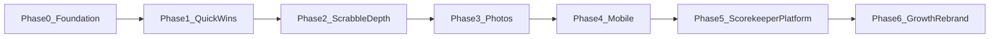

# Phase 5 — Scorekeeper Platform (Roadmap + LLD Update)

## Placement in the sequence

Phase 5 stays **after Phase 4 (Mobile)** and **before Phase 6 (Growth/rebrand)** for the recommended **platform launch** path. Scrabble-first path remains: Phase 4 → Phase 6 → Phase 5 later.



**Why after Phase 4:** Mobile wraps the same SPA; validating custom play UIs on device before growth avoids shipping a half-broken platform publicly.

**Why before Phase 6:** User decision — **new brand last**. Phase 6 becomes domain cutover + marketing for the **scorekeeper platform** (Scrabble as flagship engine), not a Scrabble-only site. Phase 5 must ship core multi-activity flows first.

**Optional Phase 1.5 (Social Profiles):** Not yet merged into [`product_roadmap_2026_36ec752e.plan.md`](c:\Users\haasl\.cursor\plans\product_roadmap_2026_36ec752e.plan.md). Cross-cutting note to add: when Phase 5 lands, profile stats (`GET /api/users/{username}`) must accept `activity_template_id` or `engine_slug` filter so pickleball win % does not mix with Scrabble.

**Phase 3 integration:** Game photos apply to all engines once Phase 3 ships. Pickleball acceptance test includes photo upload as **pass if Phase 3 complete; skip otherwise**.

---

## Files to edit / create

| Action | File |
|--------|------|
| **Edit** | [`product_roadmap_2026_36ec752e.plan.md`](c:\Users\haasl\.cursor\plans\product_roadmap_2026_36ec752e.plan.md) |
| **Rewrite** | [`phase5_multigame_impl.plan.md`](c:\Users\haasl\.cursor\plans\phase5_multigame_impl.plan.md) → full LLD (keep filename for index stability) |
| **Edit** | [`phase6_growth_impl.plan.md`](c:\Users\haasl\.cursor\plans\phase6_growth_impl.plan.md) — prerequisites: Phase 5 recommended for platform launch; landing copy reflects scorekeeper + Scrabble |
| **No repo code changes** in this step — plan documentation only |

---

## Roadmap high-level changes ([`product_roadmap_2026_36ec752e.plan.md`](c:\Users\haasl\.cursor\plans\product_roadmap_2026_36ec752e.plan.md))

### Frontmatter todos — replace `phase5-research` with sub-todos

```yaml
- id: phase5-research
  content: "Phase 5A: Scoring patterns research + approved SCOREKEEPER_SPEC.md (gate)"
  status: pending
- id: phase5-engines
  content: "Phase 5B: engine_slug refactor + Scrabble parity tests"
  status: pending
- id: phase5-custom
  content: "Phase 5C: Activity templates + custom engine (1v1 final-score)"
  status: pending
- id: phase5-teams
  content: "Phase 5D: Team session games (pickleball) + win-% dashboard"
  status: pending
- id: phase5-share
  content: "Phase 5E: In-app activity template share/import between friends"
  status: pending
- id: phase5-future
  content: "Phase 5F (backlog): Tournament + League spec only — no v1 code"
  status: pending
```

### Rename phase section title

**Phase 5 — Scorekeeper Platform** (subtitle: *Scrabble engine + custom activities*)

| | |
|---|---|
| **Priority** | #6 Platform generalization |
| **Duration** | 8–16 weeks (research + 5 sub-releases) |
| **Outcome** | User-created activities; 1v1 + 2v2 session scoring; per-activity win %; friend template import; Scrabble unchanged |
| **Implementation plan** | **[phase5_multigame_impl.plan.md](phase5_multigame_impl.plan.md)** |
| **Depends on** | Phase 4 |
| **Blocks** | Phase 6 platform rebrand (recommended) |

### High-level product narrative (new bullet block)

- **Vision:** All-purpose social scorekeeper; Scrabble is a **built-in engine**, not the whole product.
- **Engines (code-owned):** `scrabble` | `custom` (v1); future engines from research (`outcome_only`, `low_wins`, etc.).
- **Activity templates (user-owned):** Saved presets — name, engine, settings JSON (turns, timer, scoring mode, team mode).
- **Game instances:** Same [`Game`](c:\dev\scrabble-helper\backend\app\models.py) / `Round` / `GamePlayer` tables; engine-specific play + finalize.
- **UX principle:** Scrabble-first home CTA unchanged until Phase 6 rebrand; **My Activities** is opt-in secondary nav.
- **Sharing:** In-app send template to friend → import duplicate (no sync). Export file deferred.
- **Strangers:** Existing roster `Player` with `linked_user_id=null` — private win/loss on owner's stats.
- **Branding:** Internal neutral names now; user-facing rebrand in Phase 6.

### Sub-phase summary table (in roadmap)

| Sub-phase | Ships | Flagship scenario |
|-----------|-------|-------------------|
| **5A Research** | `docs/SCORING_PATTERNS_RESEARCH.md`, `docs/SCOREKEEPER_SPEC.md` | Pattern taxonomy + v1 settings schema |
| **5B Engines** | `engine_slug`, Scrabble engine extract | Zero regression on existing games |
| **5C Custom + templates** | Activity CRUD, 1v1 final score | Basketball to 21 |
| **5D Teams + stats** | Per-game team assign, win % | Pickleball foursome |
| **5E Share** | Friend template import | Alice shares "Pickleball" to Bob |
| **5F Backlog** | Design doc sections only | Tournaments, Leagues |

### Use case catalog (roadmap section — not all v1)

| Use case | Engine / pattern | Phase |
|----------|------------------|-------|
| Scrabble night | `scrabble` | Shipped; frozen in 5B |
| 1v1 basketball | `custom`, no teams, final score | 5C |
| Pickleball 2v2 (rotating partners) | `custom`, team_mode=2v2, per-game teams | 5D |
| Solo tracking + stranger roster players | `custom` + manual `Player` | 5C |
| Game photo on recap | Phase 3 `GamePhoto` | 3 + 5D test |
| Friend group win % leaderboard | Stats by `activity_template_id` | 5D |
| Template share between friends | Import copy | 5E |
| **Tournament** (bracket / round-robin, multi-match container) | New `Tournament` entity | **5F spec only** |
| **League** (season, standings, scheduled weeks) | New `League` + membership | **5F spec only** |
| Poker buy-in night | `custom` or future `ledger` engine | Research backlog |
| Golf / low-score-wins | `low_wins` engine flag | Research backlog |
| Best-of-N series | Session container | 5F spec only |
| Office recurring league + playoffs | League + Tournament | 5F spec only |

### Other roadmap sections to update

- **Mermaid flowchart:** Rename `P5` node to `Phase5_ScorekeeperPlatform`
- **Multi-game vs growth:** Default recommendation → **Phase 5 → Phase 6** (platform launch)
- **Plan file index:** Expand Phase 5 one-liner
- **Cross-cutting concerns:** Add rows — `engine_slug / activity templates | 5`, `Stats filter by activity | 5`, `Profile stats activity filter | 1.5 + 5`
- **Suggested timeline:** Q2 2027 Phase 5 before Phase 6 (swap current Q2 2027+ optional 5)
- **Review checklist:** Add items — research gate approved, pickleball acceptance test defined, tournament/league explicitly deferred

---

## LLD rewrite ([`phase5_multigame_impl.plan.md`](c:\Users\haasl\.cursor\plans\phase5_multigame_impl.plan.md))

Replace thin generic multi-game plan with structured LLD below.

### Gate (unchanged principle)

No implementation commits until user approves [`docs/SCOREKEEPER_SPEC.md`](c:\dev\scrabble-helper\docs\SCOREKEEPER_SPEC.md) (renamed from `MULTI_GAME_SPEC.md`).

---

### Deliverable 5A — Research

**New files in repo (when built):**

- [`docs/SCORING_PATTERNS_RESEARCH.md`](c:\dev\scrabble-helper\docs\SCORING_PATTERNS_RESEARCH.md) — pattern taxonomy (turn log, running score, final score only, outcome only, team session, tournament, league), competitive scan, 30–50 activity survey, allowed toggle combinations
- [`docs/SCOREKEEPER_SPEC.md`](c:\dev\scrabble-helper\docs\SCOREKEEPER_SPEC.md) — frozen v1 JSON Schema for `custom` engine settings

**Custom engine v1 settings (spec):**

```json
{
  "track_turns": false,
  "timer_enabled": false,
  "minutes_per_turn": 3,
  "scoring_mode": "final_score",
  "team_mode": "none | 2v2",
  "players_required": 2
}
```

**Allowed combos matrix** documented in spec (invalid combos rejected at template save).

---

### Deliverable 5B — Engine abstraction (commits 1–2)

**Migration `008_engine_and_activity.py`:**

- `games.engine_slug` VARCHAR(50) NOT NULL DEFAULT `'scrabble'` (backfill existing)
- `games.activity_template_id` FK nullable (null = legacy Scrabble quick-start)
- New table `activity_templates`: `id`, `owner_user_id`, `name`, `engine_slug`, `settings` JSON, `created_at`
- New table `activity_template_shares` (5E): `id`, `from_user_id`, `to_user_id`, `template_snapshot` JSON, `status`, timestamps

**Migration `009_team_side.py` (5D, can merge if preferred):**

- `game_players.team_side` ENUM `'A' | 'B' | null`

**New package:** [`backend/app/engines/`](c:\dev\scrabble-helper\backend\app\engines/)

```python
class GameEngine(Protocol):
    def validate_begin(self, game: Game) -> None: ...
    def record_turn(self, db, game, body) -> None: ...  # scrabble only
    def record_session_result(self, db, game, body) -> None: ...  # custom final score
    def finalize(self, db, game, body) -> None: ...
```

- [`backend/app/engines/scrabble.py`](c:\dev\scrabble-helper\backend\app\engines\scrabble.py) — move logic from [`services.py`](c:\dev\scrabble-helper\backend\app\services.py) `record_turn`, rack finalize unchanged
- [`backend/app/engines/custom.py`](c:\dev\scrabble-helper\backend\app\engines\custom.py) — session result path

**Refactor:** [`services.py`](c:\dev\scrabble-helper\backend\app\services.py) delegates to `get_engine(game.engine_slug)`.

**Regression:** All existing tests in [`backend/tests/`](c:\dev\scrabble-helper\backend\tests/) pass with `engine_slug=scrabble`.

---

### Deliverable 5C — Activity templates + 1v1 (commits 3–5)

**API (new routes in [`main.py`](c:\dev\scrabble-helper\backend\app\main.py) or `activities.py`):**

| Method | Path | Purpose |
|--------|------|---------|
| GET | `/api/activities` | List user's templates + built-in Scrabble shortcut |
| POST | `/api/activities` | Create template |
| PATCH | `/api/activities/{id}` | Edit |
| DELETE | `/api/activities/{id}` | Delete (block if active games) |
| POST | `/api/games` | Extend: `activity_template_id` or `engine_slug` + settings |
| POST | `/api/games/{id}/session-result` | Custom engine: `{ scores: { player_id: number } }` or side scores |
| POST | `/api/games/{id}/finalize` | Engine-specific body (Scrabble: rack; custom: empty) |

**Team win rule (5D but define here):** On finalize, players on winning side (higher total or higher side score) all get `GamePlayer.won = true`.

**Frontend (new/modified):**

- [`frontend/src/pages/ActivitiesPage.tsx`](c:\dev\scrabble-helper\frontend\src\pages\ActivitiesPage.tsx) — CRUD
- [`frontend/src/pages/ActivityEditorPage.tsx`](c:\dev\scrabble-helper\frontend\src/pages\ActivityEditorPage.tsx) — name + toggles
- [`frontend/src/pages/StartActivityPage.tsx`](c:\dev\scrabble-helper\frontend\src/pages\StartActivityPage.tsx) — pick template → players
- [`HomePage.tsx`](c:\dev\scrabble-helper\frontend\src\pages\HomePage.tsx) — add secondary "My Activities" card; keep "Start Scrabble" primary
- [`frontend/src/engines/registry.ts`](c:\dev\scrabble-helper\frontend\src\engines\registry.ts) — `PlayUI`, `FinalizeUI` per engine
- [`App.tsx`](c:\dev\scrabble-helper\frontend\src\App.tsx) — routes `/activities`, `/activities/new`, `/activities/:id/edit`, `/play`

---

### Deliverable 5D — Pickleball + win % (commits 6–8)

**Flow:**

1. Template: `team_mode=2v2`, `scoring_mode=final_score`, no timer, no turns
2. New game → pick 4 roster/friend players → assign Team A (2) / Team B (2)
3. After match → enter side scores (e.g. 11–9) → finalize
4. All players on winning side: `won=true`; all four appear in activity stats

**Stats ([`stats.py`](c:\dev\scrabble-helper\backend\app\stats.py)):**

- `GET /api/stats?activity_template_id={id}` → `{ players: [{ name, wins, games_played, win_pct }] }`
- `GET /api/leaderboard?activity_template_id={id}` — same shape, reuse friends/manual scope
- Hide Scrabble-only metrics (`avg_points_per_play`, challenges) when `engine_slug != scrabble`

**Frontend:**

- [`ActivityStatsPage.tsx`](c:\dev\scrabble-helper\frontend\src\pages\ActivityStatsPage.tsx) — win % table
- [`GameTeamSetupPage.tsx`](c:\dev\scrabble-helper\frontend\src\pages\GameTeamSetupPage.tsx) — drag or tap assign A/B
- [`GamesListPage.tsx`](c:\dev\scrabble-helper\frontend\src\pages\GamesListPage.tsx) — badge: activity name + engine

---

### Deliverable 5E — Template sharing (commits 9–10)

- POST `/api/activities/{id}/share` `{ to_user_id }` → pending notification
- POST `/api/activity-shares/{id}/accept` → creates **copy** in recipient's library with attribution `shared_from`
- Reuse [`Notification`](c:\dev\scrabble-helper\backend\app\models.py) type `activity_template_shared`

---

### Deliverable 5F — Tournament + League (spec-only backlog)

Document in research + spec; **no v1 migrations**.

**Tournament (future):**

- Entity: `Tournament` → many `Game` instances; format enum (`single_elim`, `round_robin`, `swiss`)
- Standings derived from linked game outcomes
- Use case: weekend pickleball bracket, Scrabble club championship

**League (future):**

- Entity: `League` → members, season date range, optional schedule
- Aggregates win % / points across games tagged `league_id`
- Use case: office pickleball league, weekly Scrabble ladder

**Other researched patterns** listed in SCORING_PATTERNS_RESEARCH.md with engine candidate column.

---

### Pickleball acceptance test (definition of done for 5D)

**Setup:** Users Alice (owner), Bob, Rob, Carissa — all friends with linked roster players.

| # | Step | Expected |
|---|------|----------|
| 1 | Alice creates activity "Pickleball" — 2v2, final score, no timer, no turns | Template saved |
| 2 | Alice starts game → selects all 4 → assigns Bob+Alice vs Rob+Carissa | `team_side` set on 4 `GamePlayer` rows |
| 3 | Alice enters 11–9 for A–B | Scores stored; game active or ready to finalize |
| 4 | Alice finalizes | Bob and Alice `won=true`; Rob and Carissa `won=false`; game `completed` |
| 5 | Alice starts second game — teams shuffle: Bob+Rob vs Alice+Carissa, B wins 11–7 | Win credits correct individuals |
| 6 | Activity stats page | Each person shows wins, games_played, win_pct; Alice 1–1 = 50% after step 5 if she won game 1 |
| 7 | Games list / detail | Both games visible with team composition + scores |
| 8 | Scrabble smoke | Start Scrabble game — no team UI, rack finalize works, no regression |
| 9 | Stranger path | Dave (manual player, no account) in a 1v1 activity — stats on Dave's owner only |
| 10 | Photo (if Phase 3 done) | Upload photo on pickleball game detail |

**Automated:** New [`backend/tests/test_pickleball_qa.py`](c:\dev\scrabble-helper\backend\tests\test_pickleball_qa.py) covering steps 1–6 API-level.

---

### Commit breakdown (LLD frontmatter todos)

| # | Commit | Files |
|---|--------|-------|
| 1 | Research docs (no app code) | `docs/SCORING_PATTERNS_RESEARCH.md`, `docs/SCOREKEEPER_SPEC.md` |
| 2 | `engine_slug` + backfill | migration, `models.py` |
| 3 | Scrabble engine extract | `engines/scrabble.py`, `services.py` |
| 4 | `activity_templates` table + CRUD API | `models.py`, `activities.py`, tests |
| 5 | Custom engine session result + finalize | `engines/custom.py`, API |
| 6 | Frontend activities + 1v1 play | new pages, `registry.ts` |
| 7 | `team_side` + team setup UI | migration, `GameTeamSetupPage.tsx` |
| 8 | Activity win % stats | `stats.py`, `ActivityStatsPage.tsx` |
| 9 | Template share/import | notifications, API |
| 10 | Pickleball QA test suite | `test_pickleball_qa.py` |

---

### Out of scope (explicit in both plans)

- User-defined arbitrary field schemas
- Public template marketplace
- Export/import file sharing (v2)
- Tournament/League **implementation** (5F spec only)
- Real-time score entry by non-owner linked friends
- Phase 6 rebrand / domain (Phase 6)
- Replacing Scrabble home CTA before Phase 6

---

### Risk register (add to LLD)

| Risk | Mitigation |
|------|------------|
| Scrabble regression | Engine extract + full existing test suite |
| UX confusion | Scrabble-first IA until Phase 6; "My Activities" secondary |
| Team win attribution bugs | Pickleball acceptance test + automated QA |
| Stats mixing | Filter all dashboards by `activity_template_id` |
| Scope creep (tournaments) | 5F spec-only gate |

---

## Phase 6 alignment ([`phase6_growth_impl.plan.md`](c:\Users\haasl\.cursor\plans\phase6_growth_impl.plan.md))

Minor edits:

- `prerequisites`: `[phase4]` → `[phase4, phase5]` recommended for platform launch
- Landing page bullets: scorekeeper for any game + Scrabble engine highlight
- Note: product name TBD at rebrand; code uses neutral terms from Phase 5

---

## Execution order (when user approves this plan)

1. Edit [`product_roadmap_2026_36ec752e.plan.md`](c:\Users\haasl\.cursor\plans\product_roadmap_2026_36ec752e.plan.md) with all sections above
2. Rewrite [`phase5_multigame_impl.plan.md`](c:\Users\haasl\.cursor\plans\phase5_multigame_impl.plan.md) with full LLD, frontmatter todos matching commit table
3. Patch [`phase6_growth_impl.plan.md`](c:\Users\haasl\.cursor\plans\phase6_growth_impl.plan.md) prerequisites + landing notes

No application code changes in this documentation pass.
