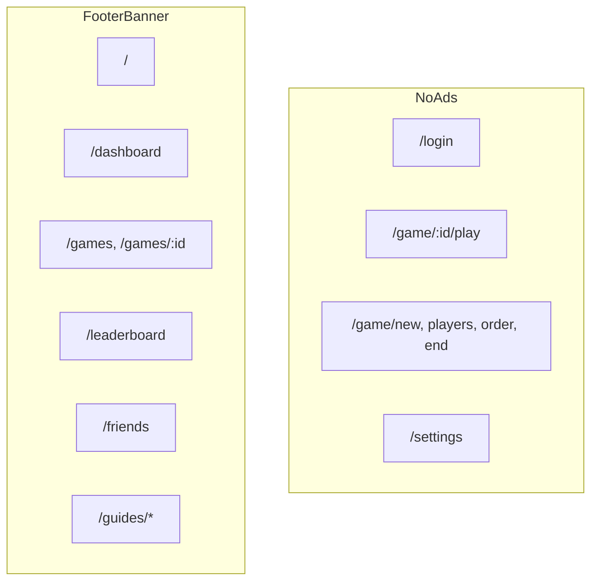

# Phase 6 — Growth: Low-Level Implementation Plan

**Roadmap context:** [Product Roadmap 2026](product_roadmap_2026_36ec752e.plan.md) → Phase 6 (LAST)

**Priorities covered:** #8 Domain/SEO/marketing, #2 Ads

**Depends on:** [Phase 4](phase4_mobile_impl.plan.md) minimum; [Phase 5](phase5_multigame_impl.plan.md) optional first if platform launch

**Related plan:** [Clean ad monetization](clean_ad_monetization_9537a7f4.plan.md)

---

## Acceptance criteria

- [ ] `https://scrabblehelper.com` serves app with valid TLS
- [ ] Google OAuth works on custom domain
- [ ] Unauthenticated visitors see marketing landing at `/`
- [ ] Logged-in users land on `/dashboard`
- [ ] AdSense footer ads on light-ad zones only; none on `/game/*` play flow
- [ ] Cookie consent banner (Consent Mode v2) before ad scripts load
- [ ] `ads.txt` reachable at domain root
- [ ] `sitemap.xml` submitted to Google Search Console
- [ ] Mobile AdMob live if native apps published (optional same release)

---

## Commit 1: Domain + OAuth cutover

### DNS (manual)

| Record | Value |
|--------|-------|
| A / AAAA | Fly.io allocated IPs for `scrabble-helper` app |
| CNAME www | `scrabblehelper.com` or Fly recommendation |

```powershell
fly certs add scrabblehelper.com -a scrabble-helper
fly certs add www.scrabblehelper.com -a scrabble-helper
fly certs check -a scrabble-helper
```

### Fly secrets (prod)

```
BASE_URL=https://scrabblehelper.com
FRONTEND_URL=https://scrabblehelper.com
```

Update [`fly.toml`](../../dev/scrabble-helper/fly.toml) env defaults for documentation only; secrets override at runtime.

### Google Cloud Console

Add authorized redirect URIs:
- `https://scrabblehelper.com/auth/callback/google`
- Keep `https://scrabble-helper.fly.dev/...` during transition

### Verification

- Login via Google on custom domain
- Session cookie domain correct (`COOKIE_SECURE=true`)

---

## Commit 2: Public routes + landing

### Route restructure

**File:** [`frontend/src/App.tsx`](../../dev/scrabble-helper/frontend/src/App.tsx)

```tsx
<Route path="/" element={<LandingPage />} />  {/* public */}
<Route path="/dashboard" element={<ProtectedShell><HomePage /></ProtectedShell>} />
<Route path="/login" element={<GuestRoute>...</GuestRoute>} />
```

**Update redirects:**
- [`ProtectedRoute`](../../dev/scrabble-helper/frontend/src/auth/ProtectedRoute.tsx): unauthenticated → `/login?next=...`
- [`GuestRoute`](../../dev/scrabble-helper/frontend/src/auth/GuestRoute.tsx): authenticated → `/dashboard`
- [`NavigateToLoginOrHome`](../../dev/scrabble-helper/frontend/src/App.tsx): user ? `/dashboard` : `/login`
- [`SiteHeader`](../../dev/scrabble-helper/frontend/src/components/SiteHeader.tsx): brand links to `/dashboard` when logged in, `/` when guest

### New pages

**New:** `frontend/src/pages/LandingPage.tsx`
- Hero, 3 feature bullets, screenshot carousel (assets in `frontend/public/marketing/`)
- CTA: "Sign in" → `/login`, "Get started" → `/login`
- Public header/footer (no NotificationBell)

**New:** `frontend/src/pages/TermsPage.tsx` — minimal ToS

**Move:** Current [`HomePage`](../../dev/scrabble-helper/frontend/src/pages/HomePage.tsx) unchanged except copy; only route path becomes `/dashboard`.

### SEO static files

**New:** `frontend/public/robots.txt`

```
User-agent: *
Allow: /
Allow: /guides/
Disallow: /game/
Disallow: /dashboard
Sitemap: https://scrabblehelper.com/sitemap.xml
```

**New:** `frontend/public/sitemap.xml` — `/`, `/login`, `/guides/*`, `/privacy`

### Meta tags

**Option A:** `vite-plugin-html` inject defaults
**Option B:** `react-helmet-async` per page

Landing needs:
- `title`, `description`
- Open Graph: `og:title`, `og:description`, `og:image` (`/marketing/og.png` 1200×630)

---

## Commit 3: Privacy expansion

**File:** [`PrivacyPage.tsx`](../../dev/scrabble-helper/frontend/src/pages/PrivacyPage.tsx)

Upgrade from Phase 3 minimal version:
- Public route (no login required)
- AdSense/third-party ad cookies
- Google Analytics if enabled
- Data retention, user rights, contact
- User-generated photo policy

**Route:** `/privacy` — public, linked from landing footer + settings

---

## Commit 4: Web ads (AdSense)

Follow [clean ad monetization plan](clean_ad_monetization_9537a7f4.plan.md).

### New module

```
frontend/src/ads/
  adPolicy.ts       # route allowlist
  AdSlot.tsx        # footer banner
  loadAdSense.ts    # script loader
  consent.ts        # Consent Mode v2 defaults
```

**`adPolicy.ts` key logic:**

```typescript
const NO_AD_PREFIXES = ["/login", "/settings", "/game/"];

export function adPlacementForPath(pathname: string): "footer-banner" | null {
  if (NO_AD_PREFIXES.some((p) => pathname.startsWith(p))) return null;
  if (pathname.startsWith("/game/")) return null; // /game/new, play, etc.
  return "footer-banner"; // /dashboard, /games, /leaderboard, /friends, /guides
}

export function adsEnabledForUser(_user: User | null): boolean {
  return true; // premium stub
}
```

**File:** [`App.tsx`](../../dev/scrabble-helper/frontend/src/App.tsx) `AppShell`:

```tsx
<AdSlot placement="footer-banner" />
```

Only mount inside authenticated shell OR also on public landing footer — **landing yes, login no**.

### Consent banner

**New:** `frontend/src/components/CookieConsent.tsx`
- Blocks `loadAdSense()` until accepted
- Google Consent Mode v2 defaults via `gtag('consent', 'default', {...})`
- Store preference in `localStorage`

### Env vars

```
VITE_ADSENSE_CLIENT_ID=ca-pub-XXXX
VITE_ADS_ENABLED=true   # false in CI/local
VITE_GA4_ID=G-XXXX      # optional
```

**Docker:** Pass as build args in [`Dockerfile`](../../dev/scrabble-helper/Dockerfile) for Fly production builds.

### ads.txt

**New:** `frontend/public/ads.txt` — line from AdSense dashboard after approval

### Styling

```css
.ad-slot { min-height: 90px; ... }
.ad-slot__label { font-size: 0.75rem; color: var(--muted); }
```

---

## Commit 5: Mobile AdMob (conditional)

Only if [Phase 4](phase4_mobile_impl.plan.md) apps published.

**Install:** `@capacitor-community/admob` or `react-native-google-mobile-ads` per Capacitor stack

**Mirror `adPolicy`:**
- Banner on `/dashboard`, `/games` list — not on play
- Optional interstitial after game complete summary only

**Store IDs:** Fly secrets / native config — not in git

**Apple/Google:** Declare ads in store privacy forms

---

## Commit 6: SEO content pages

**New pages:**

| Path | Purpose |
|------|---------|
| `/guides/scrabble-scorekeeping` | How to use app during physical game |
| `/guides/scrabble-rules-basics` | Indexable rules summary (link to app) |

Static content components; 800–1200 words each for SEO value.

**Internal links:** Landing footer, cross-link between guides

**Submit:** Google Search Console property for `scrabblehelper.com`

---

## Marketing checklist (non-code)

- [ ] UTM parameters documented for campaigns (`?utm_source=...`)
- [ ] Screenshot refresh from Phase 0 UI
- [ ] App Store / Play Store URLs on landing if mobile live
- [ ] Feedback themes from Phase 1 inform hero copy

---

## Ad zone diagram



---

## Commit 7: Manual prod approval at go-live

Until Phase 6, [Phase 0](phase0_foundation_impl.plan.md) auto-promotes merge → staging smoke → prod. At **public launch** (domain + marketing live), re-introduce a human gate on production deploys.

**Changes to** [`.github/workflows/deploy.yml`](../../dev/scrabble-helper/.github/workflows/deploy.yml):

- Split `deploy-production` into a separate job with `environment: production` (required reviewer = you)
- Staging deploy + smoke remain automatic on merge
- Prod job runs only after staging smoke passes **and** manual Environment approval

**GitHub:** Create `production` Environment with required reviewers; document in RELEASE.md that prod promote is no longer automatic.

**Why now:** Real traffic, SEO, and ads make prod regressions costlier; manual gate returns when the product is public-facing.

---

## Rollout order

1. Domain + public routes (no ads) — verify OAuth
2. Privacy + consent banner (ads still disabled)
3. Apply AdSense → add client ID → enable `VITE_ADS_ENABLED`
4. Guides + Search Console
5. AdMob last (mobile)
6. **Enable manual prod approval** (Commit 7) before marketing campaigns go live

---

## Out of scope

- Premium subscription / ad removal
- Paid marketing campaigns execution
- Blog/CMS — static pages only
