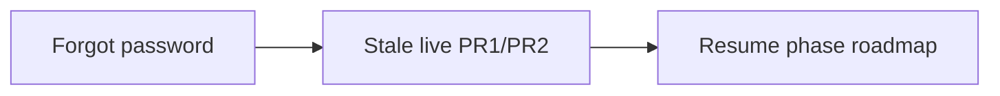
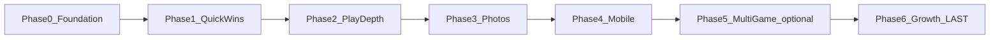
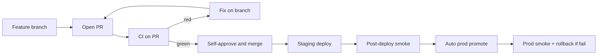

# Scrabble Helper — Product Roadmap 2026

## Immediate actions (do next — ahead of phase order)

These are **production blockers / auth ops gaps** that jump the queue. Implement via linked LLDs before resuming normal phase sequencing.

| Priority | Item | Why now | Implementation plan |
|----------|------|---------|---------------------|
| **1** | **Forgot password** | Local accounts (e.g. `@smtpsender`, admin bootstrap) cannot recover without Fly secrets / DB; Google OIDC users are fine, but email/password + admin curl need self-serve reset | **[feat_forgot_password.md](feat_forgot_password.md)** |
| **2** | **Stale live-game recovery (finish)** | PR0 (Alembic) shipped; orphan games (e.g. #309) still block new play until sweep/UX PRs land | **[fix_stale_live_game_recovery.md](fix_stale_live_game_recovery.md)** (PR1 → PR2) |



**Handoff:** Say **"build forgot password"** or **"build stale-live PR1"** to execute the linked plan.

---

## Current state (baseline)

- **Stack:** Monolithic FastAPI + React SPA in one Docker image on [Fly.io](https://scrabble-helper.fly.dev); Postgres in prod (SQLite volume fallback in [`fly.toml`](../../dev/scrabble-helper/fly.toml)).
- **Deploy:** Manual `fly deploy`; CI in [`.github/workflows/ci.yml`](../../dev/scrabble-helper/.github/workflows/ci.yml) runs tests only — no staging, no canary.
- **Routes:** All authenticated except `/login`. Live play at `/game/:id/play`; recap at `/games/:id`. Reference pages: `/game/rules`, `/game/dictionary` (back to play via `?gameId=`).
- **Dictionary:** Local ENABLE list; `GET /api/dictionary/check/{word}`; challenge-only exact-word lookup.
- **Existing hooks:** SMTP via [`email_send.py`](../../dev/scrabble-helper/backend/app/email_send.py); `Round.word` + `input_mode` in game settings (word tracking UI still pending).

---

## Sequencing principle

**Perfect the product first → grow last.** Domain, SEO, marketing, and ads are Phase 6 only.



**Multi-game vs growth (your choice at Phase 5):**
- **Scrabble-first launch (recommended):** Phase 4 → Phase 6 growth → Phase 5 multi-game later
- **Platform launch:** Phase 5 → Phase 6

---

## Phases — summary + implementation plans

Each phase has a **low-level implementation plan** (file paths, commits, APIs, acceptance criteria). Review the linked plan before pressing Build on that phase.

### Phase 0 — Foundation

| | |
|---|---|
| **Priorities** | #9 Release procedure, #10 UI overhaul |
| **Duration** | 1–2 weeks |
| **Outcome** | PR-first workflow; staging → smoke → **auto prod**; UI direction chosen and applied app-wide |
| **Implementation plan** | **[Phase 0 — Foundation (implementation)](phase0_foundation_impl.plan.md)** |

**High-level:** Feature branch → PR → CI → merge. Staging Fly app, chained deploy (staging smoke → auto prod → prod smoke + rollback), `/health?db=1`, RELEASE.md. No manual prod gate until Phase 6 go-live. User picks UI A/B/C.

**Blocked on you:** Pick UI direction (A Boardroom Classic, B Game Night Warm, C Clean Scorecard) before UI commits start.

---

### Phase 1 — Quick wins

| | |
|---|---|
| **Priorities** | #1 Feedback, known QA bugs |
| **Duration** | 3–5 days |
| **Outcome** | Feedback emails to you; owner always in game; 2.5h inactivity warning |
| **Implementation plan** | **[Phase 1 — Quick Wins (implementation)](phase1_quick_wins_impl.plan.md)** |

**High-level:** `POST /api/feedback`, bottom-right FAB, auto-include owner player, `last_activity_at` + warning modal on play page.

**Depends on:** Phase 0 (release pipeline recommended before prod deploy).

---

### Phase 2 — Play depth

| | |
|---|---|
| **Priorities** | #7 Rules page, #5 Dictionary |
| **Duration** | 2–3 weeks |
| **Outcome** | Rules during play with one-tap back; word lookup + optional word tracking on turns |
| **Implementation plan** | **[Phase 2 — Play Depth (implementation)](phase2_play_depth_impl.plan.md)** |

**High-level:** `/game/rules` + `/game/dictionary` (static routes, back via `?gameId=`), local ENABLE word list, exact-word challenge lookup, `input_mode: "word"` in a follow-up PR. See [phase2_play_depth_impl.plan.md](phase2_play_depth_impl.plan.md).

**Depends on:** Phase 1.

---

### Phase 3 — Photos & privacy

| | |
|---|---|
| **Priority** | #4 Photo upload |
| **Duration** | ~2 weeks |
| **Outcome** | Board/family photos on play + detail; minimal `/privacy` |
| **Implementation plan** | **[Phase 3 — Photos & Privacy (implementation)](phase3_photos_impl.plan.md)** |

**High-level:** R2/S3 storage, `GamePhoto` model, upload/gallery/lightbox, authenticated privacy page.

**Depends on:** Phase 2.

---

### Phase 4 — Mobile apps

| | |
|---|---|
| **Priority** | #3 iOS + Android |
| **Duration** | 4–8 weeks |
| **Outcome** | Capacitor apps on TestFlight + Play internal testing; **no ads** |
| **Implementation plan** | **[Phase 4 — Mobile Apps (implementation)](phase4_mobile_impl.plan.md)** |

**High-level:** Capacitor wrap, API base URL, OAuth/deep links, native photo picker (take photo or choose from phone library), safe-area CSS.

**Depends on:** Phase 3.

---

### Phase 5 — Multi-game (optional)

| | |
|---|---|
| **Priority** | #6 Generalize to other games |
| **Duration** | 4–12 weeks |
| **Outcome** | Research doc + approved spec + `game_type_slug` abstraction |
| **Implementation plan** | **[Phase 5 — Multi-Game (implementation)](phase5_multigame_impl.plan.md)** |

**High-level:** **No code until spec approved.** Research sprint → `game_type` registry → conditional play UI.

**Depends on:** Phase 4. Can defer until after Phase 6 if marketing Scrabble-only.

---

### Phase 6 — Growth (LAST)

| | |
|---|---|
| **Priorities** | #8 Domain/SEO/marketing, #2 Ads |
| **Duration** | 2–3 weeks |
| **Outcome** | scrabblehelper.com live, public landing, AdSense + consent, SEO guides, AdMob if mobile shipped |
| **Implementation plan** | **[Phase 6 — Growth (implementation)](phase6_growth_impl.plan.md)** |

**High-level:** Domain/OAuth cutover, `/` public + `/dashboard` protected, ads module per [clean ad monetization plan](clean_ad_monetization_9537a7f4.plan.md), guides, Search Console.

**Also see:** [Clean ad monetization](clean_ad_monetization_9537a7f4.plan.md) (detailed ad placement philosophy).

**Depends on:** Phase 4 minimum.

---

## Build workflow (when you press Build)

When you approve the roadmap and say **build** (or **execute Phase N**):

1. **Read** this roadmap phase summary + the linked **implementation plan** for that phase.
2. **Execute phases in order** (0 → 1 → … → 6). Do not skip unless you explicitly waive a phase.
3. **Feature branch per task** → open PR → **CI must pass on PR** → author self-approves → merge to `main`.
4. **One small commit per task** on the branch (matches epic workflow rule).
5. **Definition of done** = acceptance criteria in impl plan + CI green on PR + deploy workflow green after merge.
6. **Deploy after merge:** staging → smoke → **auto prod** → smoke → rollback on prod failure (Phase 0 pipeline). **No manual prod approval** until Phase 6 go-live.
7. **Stop between phases** for your review unless you say "continue through Phase N."



### Developer handoff template

For each phase, the assigned developer should start with:

```
Phase: N
Roadmap: product_roadmap_2026_36ec752e.plan.md
Implementation plan: phaseN_*_impl.plan.md
Branch: phaseN/short-task-name
PR: required before merge to main
Acceptance criteria: [copy from impl plan]
Out of scope: [copy from impl plan]
```

### Plan file index

| Phase | Implementation plan |
|-------|---------------------|
| Immediate | [feat_forgot_password.md](feat_forgot_password.md), [fix_stale_live_game_recovery.md](fix_stale_live_game_recovery.md) |
| 0 | [phase0_foundation_impl.plan.md](phase0_foundation_impl.plan.md) |
| 1 | [phase1_quick_wins_impl.plan.md](phase1_quick_wins_impl.plan.md) |
| 2 | [phase2_play_depth_impl.plan.md](phase2_play_depth_impl.plan.md) |
| 3 | [phase3_photos_impl.plan.md](phase3_photos_impl.plan.md) |
| 4 | [phase4_mobile_impl.plan.md](phase4_mobile_impl.plan.md) |
| 5 | [phase5_multigame_impl.plan.md](phase5_multigame_impl.plan.md) |
| 6 | [phase6_growth_impl.plan.md](phase6_growth_impl.plan.md) |

---

## UI direction options (Phase 0 — pick one)

| Option | Name | Summary |
|--------|------|---------|
| **A** | Boardroom Classic | Serif headings, tile-board motif, forest green accent |
| **B** | Game Night Warm | Rounded cards, warm orange secondary, playful CTAs |
| **C** | Clean Scorecard | Flat cards, DM Sans/Inter, minimal gradients |

Your established palette: cream `#f4f1ea`, accent `#0f6b4d`, card tile home, light/dark themes — see [styles.css](../../dev/scrabble-helper/frontend/src/styles.css).

---

## Cross-cutting concerns

| Concern | Phase |
|---------|-------|
| Release safety | 0 |
| Access control reuse (`get_game_access`) | 2, 3 |
| Privacy policy | 3 minimal → 6 full public |
| DB migrations | 1, 3, 5 |
| Mobile UX (FAB, drawers, safe areas) | 1–4 |
| Native photo pick (camera + library) | 4 |
| Ads | 6 only |

---

## Suggested timeline (solo dev)

| Quarter | Phases |
|---------|--------|
| Q3 2026 | 0, 1 |
| Q4 2026 | 2, 3 |
| Q1 2027 | 4 |
| Q2 2027 | 6 (growth) |
| Q2 2027+ | 5 optional |

---

## Your review checklist

Before pressing **Build** on the full roadmap:

- [ ] **Immediate actions** reviewed (forgot password, stale-live finish)
- [ ] Phase order approved (growth last)
- [ ] UI direction A, B, or C selected
- [ ] Phase 5 timing: before or after Phase 6?
- [ ] Each linked implementation plan reviewed
- [ ] Multi-game Phase 5: confirm research-first gate acceptable

After review, say **"build forgot password"** or **"build Phase 0"** to start, or **"build roadmap"** to execute all phases sequentially with stops for review between phases.
